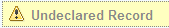

# Declaring a record

Documents are not automatically considered to be a record. An uploaded document is not considered to be part of the Records Management system until it has been declared as a record.

1.  Navigate to the uploaded document in the File Plan.

    Undeclared records are identified with the an Undeclared Record label.

    

2.  Click **Declare as Record** from the actions list.

    Records have mandatory metadata that you must complete. This action does not appear in the actions list until you have completed the mandatory metadata.

3.  Click **Save**.

Once a record is declared, it is then under the control of the record category, and security restrictions apply.

**Note:** A record can be filed in multiple categories.

**Parent topic:**[File Plan structure](../concepts/rm-fileplanstruct-create.md)

