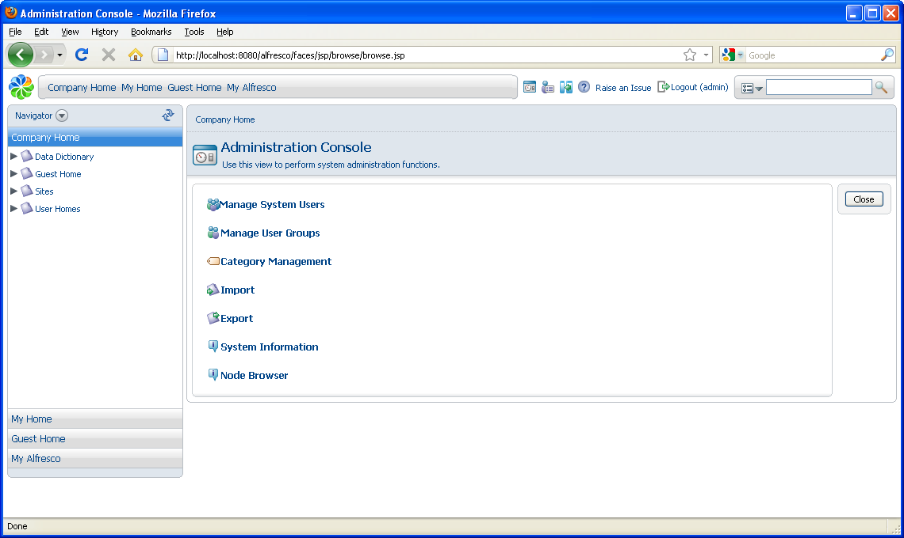
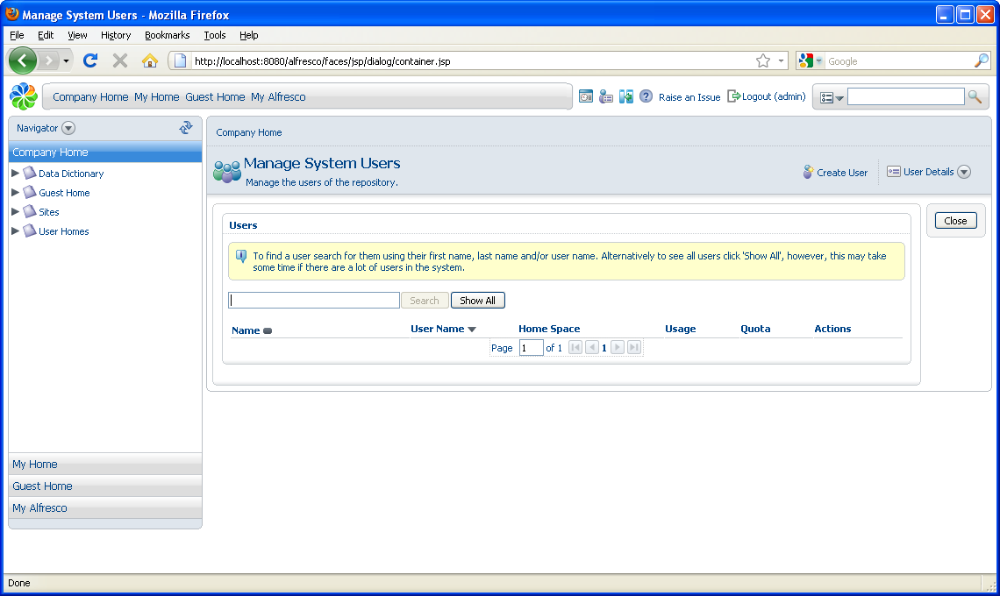

# Adding new users

As part of adding the new user, you can define the user's home space. When Alfresco is installed, a User Homes space is created automatically to contain all user home spaces.

1.  On the toolbar, click  **\(Administration Console\)**.

    The Administration Console opens.

    

2.  Click **Manage System Users**.

    The Manage System Users page opens.

    

3.  Click **Show All** to list the current users, including the pre-configured **admin** account.

4.  In the header, click **Create User** to open the **New User Wizard**.

5.  In the **New User Wizard**, specify the person properties. Use the name Bob Smith and the email address bob@alfrescodemo.org, then click **Next**.

    Boxes marked with an asterisk are required.

6.  Create a user name and password.

7.  Create a home space using the default location, **User Homes**, that was created during installation and name the space Bob Smith.

    **Note**: User names are case insensitive but domains are case sensitive. Users can log in with any combination of case for their name but the domain must remain as created.

    For example, the following are true for logging in:

    -   jsmith/ALFRESCO can log in as: jsmith/ALFRESCO or JSMITH/ALFRESCO or JsMiTh/ALFRESCO
    -   jsmith/alfresco can log in as: jsmith/alfresco or JSMITH/alfresco or JsMiTh/alfresco
    -   jsmith/AlFrEsCo can log in as: jsmith/AlFrEsCo or JSMITH/AlFrEsCo or JsMiTh/AlFrEsCo
8.  Click **Next** to view a summary of the user created and click **Finish**.

    This creates the new user, Bob Smith, and his home space. Click **Show All** to list the users.

9.  Create another user named Joe Bloggs for future use.

**Parent topic:**[Getting Started with Alfresco Explorer Document Management](../concepts/cgs-intro.md)

