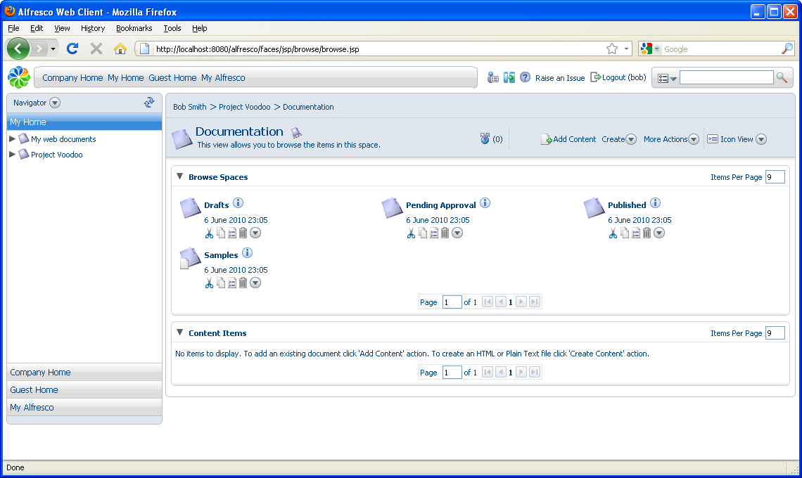
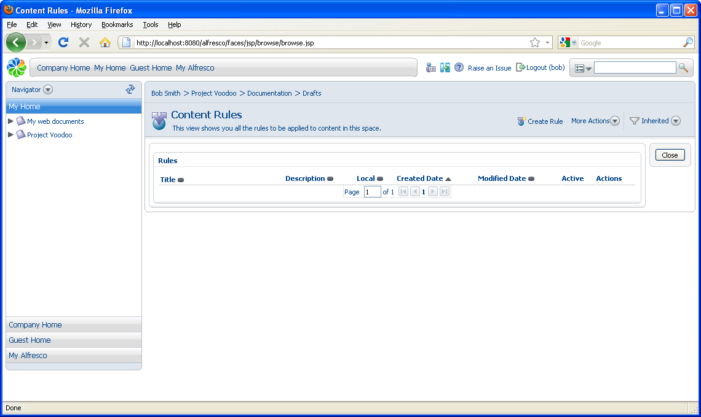

# Creating content rules

In this task you will create content rules within a space.

You will create a few rules in the Project Voodoo Documentation space to:

-   Add content versioning because multiple authors will collaborate on the documents

-   Set up a simple workflow that allows the documents to progress through these spaces

1.  Navigate to the Project Voodoo Documentation space. This space contains four sub spaces to hold documents in different stages of completion, as well as a space with sample content.

    

2.  Click **Drafts** to open the Drafts space.

3.  In the **More Actions** menu, select **Manage Content Rules**. The Content Rules page appears.

    

**Parent topic:**[Building smart spaces](../concepts/cgs-smartspace.md)

