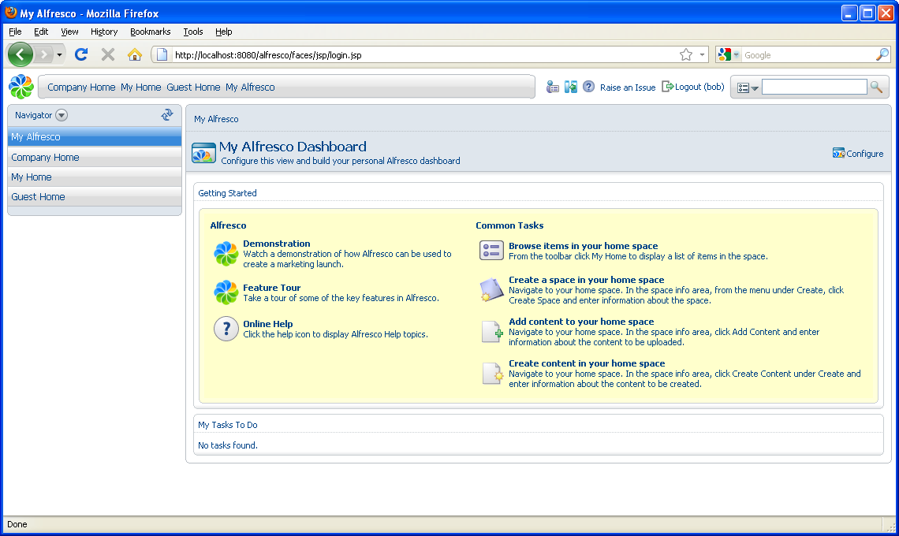
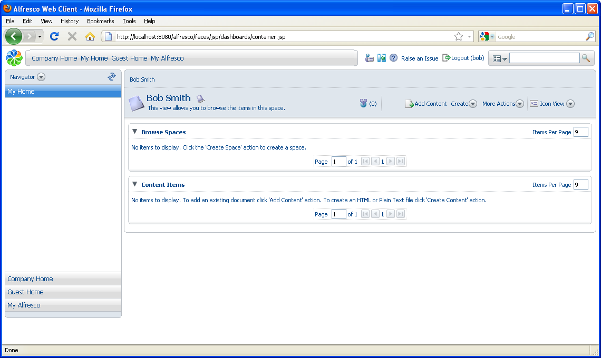

# Creating spaces and content

After adding a new user, you can log in as that user.

1.  On the toolbar, click **Logout**, then log in using the details for Bob Smith.

    You are taken to your **My Alfresco Dashboard** by default, but you can still easily navigate to your home space \(My Home\), Company Home, or elsewhere.

    

2.  Click **My Home** in the sidebar.

    In the home space you can add and create content items, and create sub spaces.

    

-   **[Creating a space](../tasks/tgs-create-space.md)**  
Before adding content, organize your home space to meet your business needs \(including collaboration\). For this example, you will create a sub space called *My web documents* for HTML files.
-   **[Creating and editing content in a space](../tasks/tgs-createedit-content.md)**  
In this task, you will create content in a space using the Create Content Wizard.
-   **[Managing content item details](../tasks/tgs-manage-contentdetails.md)**  
You can view the details \(properties and metadata\) of a content item at any time.

**Parent topic:**[Getting Started with Alfresco Explorer Document Management](../concepts/cgs-intro.md)

