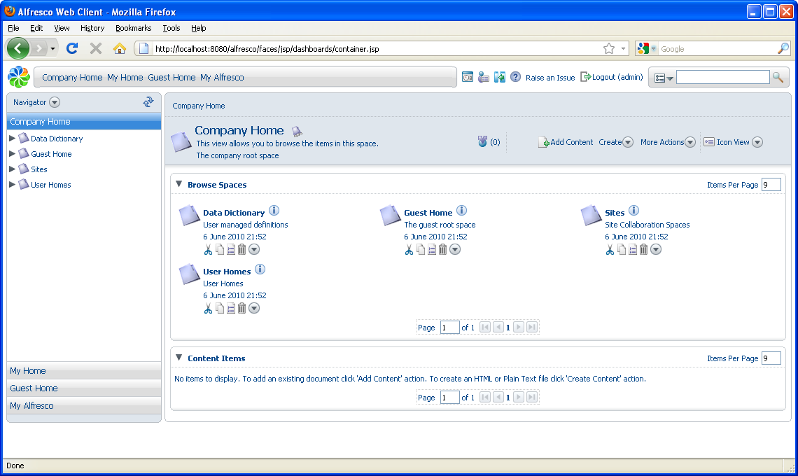

# Logging in

To add and create content in Alfresco, you must log in. When Alfresco is installed, it creates an administration user called *admin* with a default password of *admin*. The **Password**field is case sensitive.

1.  Click the **Login \(guest\)** link in the toolbar.

2.  On the **Login** page, enter admin in the **User Name** box.

3.  Enter admin in the **Password** box and click **Login**.

4.  In the toolbar, click **Company Home.**

    The Company Home space displays.

    

**Parent topic:**[Starting with Explorer](../concepts/cgs-starting.md)

