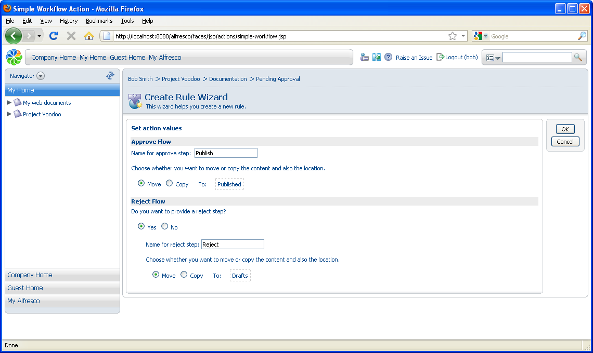

# Publishing the approved content

Continue with the workflow rule that will apply to content in this space.

Now that you have finished defining rules in the Drafts space, navigate to the Pending Approval space \(**Project Voodoo \> Documentation \> Pending Approval**\) to add the next step in the workflow.

**Note:** There is no need to add a rule to make all content versioned, since content has moved from the Drafts space where it will have already been versioned.

1.  In the **More Actions** menu, click **Manage Content Rules**.

2.  Click **Create Rule** in the header.

3.  In Step One, specify **All items** as the condition.

4.  In Step Two, specify **Add simple workflow** as the action.

    1.  Enter Publish as the **Approve Flow** step name.

    2.  Select to **Move** the item to the Published space.

    3.  Select **Yes** as the **Reject Flow** step and name it Reject.

    4.  Select to **Move** the item back to the Drafts space.

        

5.  In Step Three, specify the **Type** as **Items are created or enter this folder** and type Add simple workflow as the **Title**.

6.  Click **Finish** to complete the wizard.

    To see these rules in action, you must add some content.

**Parent topic:**[Adding simple workflow rules](../concepts/cgs-add-workflowrule.md)

