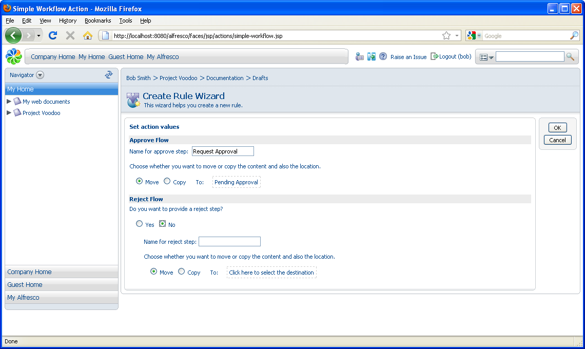

# Requesting draft approval

In this task you will create a simple workflow rule to apply to content in the Drafts space.

1.  Ensure you are on the Content Rules page in the Drafts space. Click **Create Rule**in the header.

2.  In Step One, specify **All Items** as the condition.

3.  In Step Two, specify **Add simple workflow** as the action.

    1.  Enter Request Approval as the Approve Flow step name.

    2.  Select to **Move** the item to the **Pending Approval** space.

    3.  Select **No** as the Reject Flow step.

        

4.  In Step Three, specify the **Type** as **Items are created or enter this folder** and enter Add simple workflow as the **Title**.

5.  Click **Finish** to complete the wizard.

**Parent topic:**[Adding simple workflow rules](../concepts/cgs-add-workflowrule.md)

