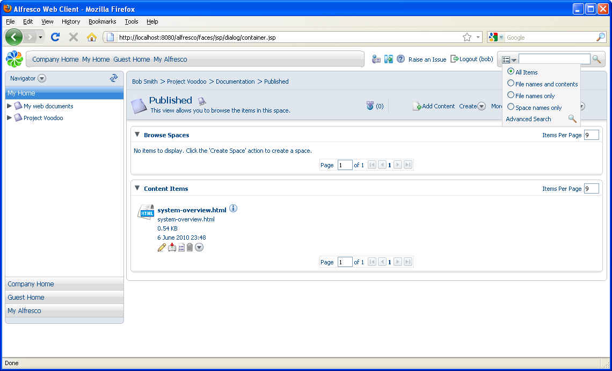
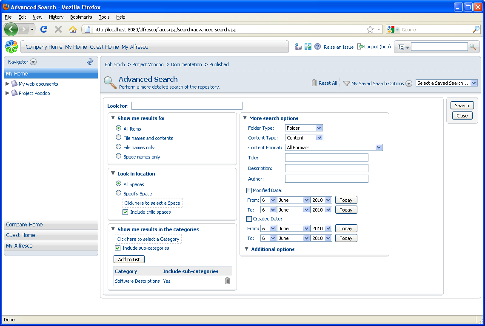

# Searching for categorized content

In this task you will use Advanced Search features to search for categorized content.

1.  Click  **\(Options\)** in the toolbar.

    

2.  Select **Advanced Search**.

    The Advanced Search provides multiple criteria, including categories, under which you can search for a content item.

3.  Expand the pane Show me results in the categories if it is not already visible.

4.  Add **Software Descriptions** as the category, ensuring you check **Include sub-categories**.

5.  Click **Add to List**.

    

6.  Click **Search**. For this example, there is only one document that matches this criteria.

    **Note:** You can also include other options for the search, such as the kind of document you are looking for, or a range of dates for its creation or modification.

**Parent topic:**[Categorizing content and advanced search](../tasks/tgs-categorize-content.md)

