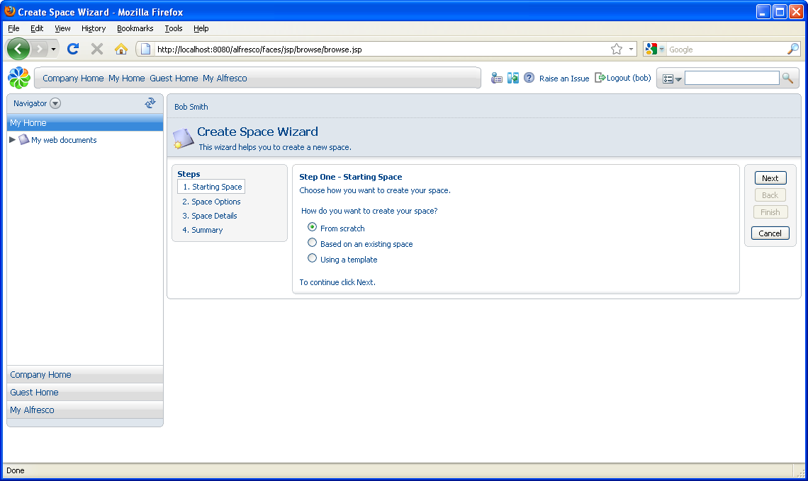
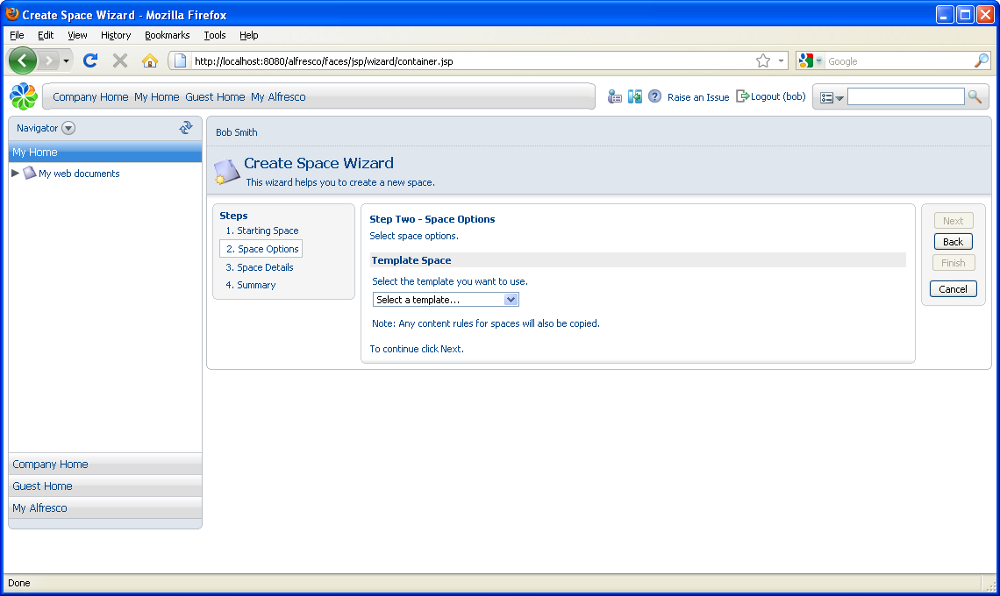
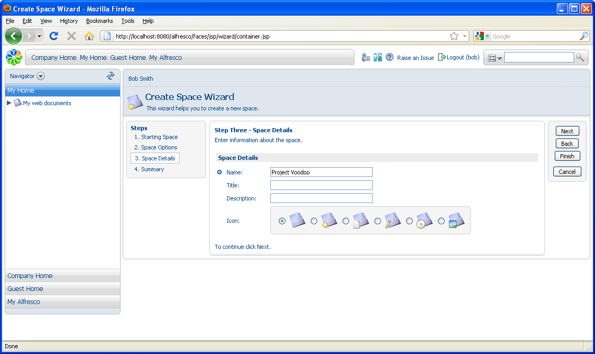

# Working with space templates

You can use templates that you create or that are provided to accelerate the setup of a space and to ensure consistency across multiple spaces.

In this scenario, you will set up a project space with multiple sub spaces in which you will collaborate with other team members to create, approve, and publish documents. Part of the requirements you have for this space are provided by a template.

1.  Navigate to your home space \(you can use the breadcrumb path or click **My Home** on the toolbar\).

2.  In the **Create** menu, click **Advanced Space Wizard**. The Create Space Wizardpage displays.

    

3.  In Step One - Starting Space, select **Using a template** and click **Next**.

    

4.  In Step Two – Space Options, select the **Software Engineering Project** template from the list and click **Next**.

5.  In Step Three - Space Details, type Project Voodoo as the **Name**. Optionally, you can specify a title and description, and select an icon.

    

6.  Click **Finish** to return to the My Home space where the Project Voodoo space has been created using the Software Engineering Project template.

**Parent topic:**[Getting Started with Alfresco Explorer Document Management](../concepts/cgs-intro.md)

