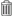

# Removing a category link from a content item

If you no longer want a content item linked to a specific category, you can break the connection.

1.  Navigate to the content item you want to remove the category link from and click  **\(View Details\)** for that item.

2.  In the Category pane, click  to expand the pane, if it is not open.

3.  Click  **\(Change Category\)**.

4.  On the Modify categories page under **Selected categories**, click  **\(Remove\)** next to each category you want to remove from this content item.

5.  Click **OK**.

**Parent topic:**[Using categories](../concepts/cuh-categories.md)

