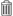

# Removing items from the clipboard

Remove items from the clipboard that you no longer require.

To remove items from the clipboard:

1.  Display the **Shelf** in the sidebar, if it is not already visible.

2.  If not already displayed, click  to the left of **Clipboard** to display the clipboard contents.

3.  Do one of the following:

    -   To remove an individual item from the clipboard, click  **\(Remove Item\)** next to the item you want to remove.
    -   To remove all items from the clipboard, click **Remove All**.

**Parent topic:**[Using the clipboard](../tasks/tuh-clipboard-view.md)

