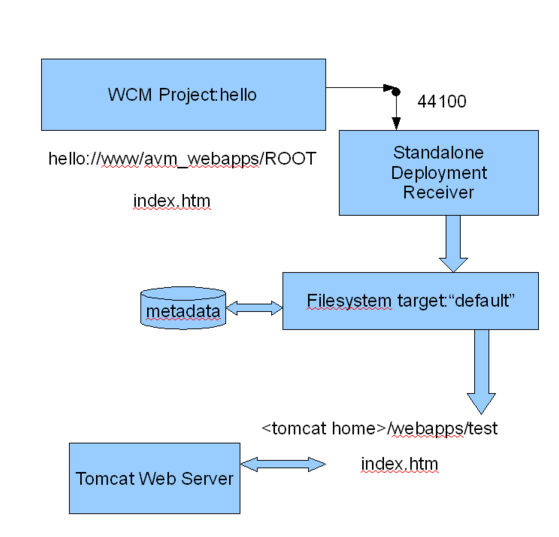

# Single web project deployed to Tomcat

This is an example of how to deploy content to a separate instance of Tomcat to receive your deployment.

This example installs a test server which can be used to receive the contents of your authoring sandbox. It also sets `SourcePath` to just deploy the contents of the ROOT folder into the "hello" webapp and not the root folder itself.

The files to be deployed need to be placed in <tomcat home\>/webapps/hello.

1.  Install a standalone deployment receiver on the machine with your instance of Tomcat.

2.  Configure the file system deployment target that comes with the standalone deployment receiver.

3.  Open the deployment.properties file and set the `deployment.filesystem.datadir` property to where you want your content to go.

    For example, in this case c:/tomcat/webapps/hello.

4.  In Alfresco Explorer, create a Web Project called "hello".

5.  On the Web Project Details window:

    1.  Set a name of `hello`.

    2.  Set the DNS Name to `hello`,

    3.  Leave the default webapp as `ROOT`.

6.  On the Configure Deployment Receivers window:

    1.  Add Deployment Receiver.

    2.  In the **Display Name** field, type `hello`.

    3.  In the **Display Group** field, type `demo`.

    4.  In the **Type** field, type `Test Server`.

    5.  In the **Host** field, type the host name or IP address of your standalone deployment receiver.

    6.  In the **Port** field, type `44100`.

    7.  In the **Username** field, type `admin`, and the **Password**, type `admin`.

    8.  In the **Source Path** field, type `ROOT`.

    9.  In the **Target Name** field, type `default`.

7.  Add a file called index.htm containing `hello world`.

8.  Deploy your web project to your test server.

Now you should be able to open `<your tomcat webserver>/hello` and see `hello world`.

**Parent topic:**[Filesystem deployment target](../concepts/wcm-targets-filesystem.md)

