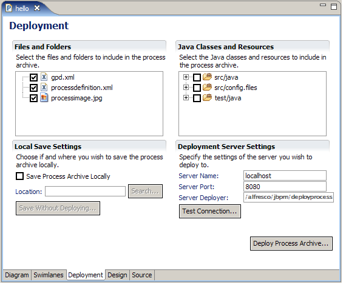

# Deploying a process definition

Use the JBoss jBPM Process Designer to save a process definition to a process archive file or to deploy directly to an existing server. Alfresco supports deployment directly to Alfresco.

1.  Enable the jBPM Deploy Process Servlet by adding the following setting to the alfresco-global.properties file:

    `system.workflow.deployservlet.enabled=true`

    **Note:** This allows you to upload workflows directly into Alfresco; however, this setting is not recommended in a production environment because it allows unauthenticated deployment of new workflows.

2.  Restart the Alfresco server.

3.  At the bottom of the Process Designer window, click the **Deployment** tab.

4.  In the Deployment Server Settings block in the **Server Name** field, enter the name of the machine where Alfresco is installed.

5.  In the **Server Port** field, enter the port number assigned to Alfresco \(default: 8080\).

6.  In the **Server Deployer** field, enter /alfresco/jbpm/deployprocess.

7.  Click **Test Connection**.

8.  If the test is successful, click **Deploy Process Archive**.

    You do not need to restart the Alfresco server to activate the newly deployed process definition. Using the jBPM Process Designer allows quick turnaround while testing new process definitions.

The process definition is now available for use by Alfresco.

The following image shows using the Process Designer to deploy a process definition.

**Parent topic:**[Process definition deployment](../topics/wf-intro-deploy-pd.md)

