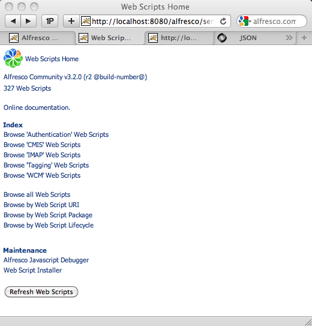

# Listing pre-built web scripts

The Hello World example demonstrates how to create a simple web script, but there are many pre-built web scripts provided out-of-the-box available for reuse. Before developing a new web script, always check to see if one already exists that supports your requirements or is near enough to save you time.

The Web Script Framework keeps an index of all web scripts registered in the Alfresco content application server, which makes it easy to establish what is already available. It is not unusual for hundreds of web scripts to be registered. To ease navigation the index organizes web scripts by:

-   URI
-   Web script package
-   Web script family

A web script package is a collection of related web scripts, such as those for integrating with Microsoft Office or those providing the CMIS AtomPub binding.

A web script family identifies web scripts of a similar kind, such as portlets and Share dashlets. Think of families as a way of tagging or categorizing web scripts.

To display an HTML page of the index:

1.  Type the URI http://localhost:8080/alfresco/service/index.

2.  If prompted, log in with the user name admin and password admin.

    The Web Scripts Home page displays.

    

    The index contains an entry for each registered web script and provides several ways to navigate through them.

    Each web script displays a full description including its URI\(s\) for invocation.

3.  Drill down into the implementation of the web script to see its descriptor, controller script, and response template components.

    This can be very useful as a learning resource or as the basis for a copy/paste approach to creating new web scripts.

**Parent topic:**[Working with Alfresco web scripts](../concepts/ws-architecture.md)

**Related information**  

[Creating a Hello World web script](ws-hello-world-create.md)

