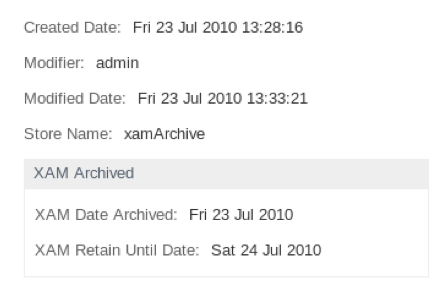

# Testing the XAM Connector module

These steps describe how to test the XAM Connector module with Alfresco.

1.  Enable `DEBUG` logging for the Alfresco XAM components.

    For example:

    ```
    log4j.logger.org.alfresco.enterprise.repo.content.xam=DEBUG
    log4j.logger.org.alfresco.enterprise.repo.xam=DEBUG
    ```

2.  Add the `xam:archived` aspect in the share-config-custom.xml file.

    For example:

    ```
    <alfresco-config>
    
       <config evaluator="node-type" condition="cm:content">
          <forms>
             <form>
    
                <!-- 2 column template -->
                <edit-form />
    
                <field-visibility>
    
                <!-- aspect: cm:storeSelector -->
                <show id="cm:storeName" />
    
                <!-- aspect: xam:archive -->
                <show id="xam:dateArchived" for-mode="view" />
                <show id="xam:retainUntil" for-mode="view" />
    
                <show id="cm:content" for-mode="view" />
    
                </field-visibility>
                <appearance>
                   <!-- Store Selector -->
                   <field id="cm:storeName" label="Store Name" description="Content Store Name" />
                   <set id="xam-archive" appearance="bordered-panel" label="XAM Archived" />
                   <field id="xam:dateArchived" label="XAM Date Archived" set="xam-archive" />
                   <field id="xam:retainUntil" label="XAM Retain Until Date" set="xam-archive" />
    
                </appearance>
             </form>
          </forms>
       </config>
    
    <config evaluator="string-compare" condition="DocumentLibrary">
       <aspects>
             <visible>
                <aspect name="cm:storeSelector" label="Store Selector"/>
                <aspect name="xam:archive" label="XAM Archive" />
             </visible>
             <addable>
                <aspect name="xam:archive" label="XAM Archive" />
             </addable>
       </aspects>
    </config>
    
    </alfresco-config>
    ```

3.  Create a sample document.

    For example, abc.txt.

4.  Apply the `xam:archived` aspect to the document.

    

5.  View the metadata for the document.

    You must also ensure that the new store is the **xamStore** and that the **retainedUntil** date is set.

6.  Use the Node Browser to locate the content URL for the node.

    The URL must be a XAM XRI-based URL. The debug output should also show the XUID used.

7.  Copy the XAM XRI, and then open the XSet using the shXAM tool.

    For example:

    ```
    shXAM>openxset AAAEcwA9f4xCRlE4MU1OM1Q4NzRGZTIySkQ5NVFINjM2RUNHNDE1SkpPRDlCUDFHQkdMUExMQVJMTlNMRA==
    
    XSet opened
    ```

    1.  Use the following command to check that the base retention has been set:

        `viewFields .xset.retention.base`

    2.  Use the following command to check that node properties have been copied over:

        `viewFields xam.archive`


**Parent topic:**[Installing the XAM Connector module](../tasks/xam-install-amp.md)

