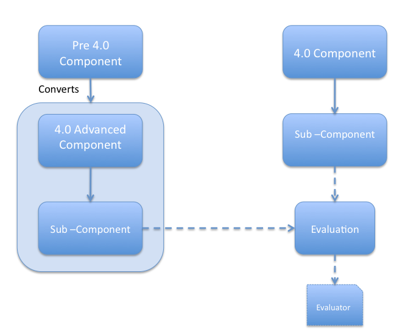

# Customizing Share through Advanced Component configuration

You can also customize Share through Advanced Component configuration.

New to 4.0, Advanced Components can be extended to:

-   Add, remove, and modify the content within a Component
-   Have a Component display different content dynamically, based on request information \(such as a site being accessed, or the current user\)
-   Re-order existing Sub-Components

## Component and Sub-Components

-   Components contain “Sub-Components”
-   Sub-Components are rendered to provide content
-   Old configuration Components are converted to an Advanced Component with a single Sub-Component

    -   No updates are required to existing Share configuration
    -   Existing Share components can be added to overridden
    

## Evaluations

The purpose of an Evaluation is to dynamically alter a Sub-Component based on the current request. This is done by either changing the web script URL, updating the properties passed to the web script or preventing the Sub-Component from rendering entirely \(which is demonstrated in the [Hide Content on an Existing Alfresco Share Page](../tasks/tu-40-hide-content.md) tutorial\).

A Sub-Component should be defined with a default web script URL and properties which will be used if no evaluations are configured or none of the evaluations that are configured evaluate successfully. If more than one evaluation is defined, then each will be processed in turn and the first to evaluate successfully will have the opportunity to override the web script URL and/or properties or to hide the Sub-Component.

Evaluations are processed in the order in which they are defined in the configuration file. Evaluations defined in extension modules are processed before evaluations in the “base” Component configuration. If more than one extension module defines evaluations for the same Sub-Component then they processed in the deployment order defined through the Module Deployment UI \(/service/page/modules/deploy\).

Alfresco uses Evaluations internally to update add, hide, and change various Sub-Components in the Document Library page, depending on what type of site is being viewed.

To summarize:

-   A Sub-Component can optionally have an Evaluation
-   Successful evaluation can indicate that rendering should or shouldn't occur
-   Evaluation can contain zero or more evaluators
-   Evaluations act as an “AND” gate
-   Evaluators can be negated
-   Evaluations provide alternative URIs and/or property overrides

## Evaluators

Every Sub-Component Evaluator must be configured in the Spring application context as a bean and must implement the org.springframework.extensions.surf.extensibility.SubComponentEvaluator interface. The interface defines a single method called evaluate that takes an org.springframework.extensions.surf.RequestContext and a parameter map as arguments.

A Sub-Component Evaluation will call the evaluate method on each Evaluator that is configured with and will only be considered to have evaluated successfully if every evaluate method returns True.

A number of SubComponentEvaluator instances are already configured in the Alfresco Share application context for testing various criteria \(such as whether or not the requested page relates to a particular site\) but it is a fairly simple exercise to create your own instances.

The RequestContext instance passed into the evaluate method will let you access pretty much everything you need to know about the request being evaluated \(there's too much information to list, the best way to see everything available would be to attach a Java debugger to the web server and set a break point in an evaluator an inspect an instance\).

## Module Evaluator

-   In Version 4.0, module evaluators are processed once per request
-   Can contain “Customization” and “Component” extensions
-   Reduced number of evaluations, improved performance
-   More complex configuration

## Extensions and Modules

Extension Modules allow web scripts to replace or extend from Sub-Components.

-   An “Extension” can contain zero or more “Modules”
-   An Extension can be configured within the application \(e.g. Portlet extension\) or externally in  a JAR \(e.g. RM extension\)
-   Two deployment modes “auto” and “manual” \(manual is default\)
-   Default module configuration can be overridden when deployed
-   Modules can be dynamically deployed and removed without server restart

-   **[Creating an Extension module](../tasks/Create-a-Model.md)**  
Using Advanced Components, you create extension modules to allow web scripts to replace or extend from Sub-Components.
-   **[SurfBug](../concepts/Surf_v4_surfbug.md)**  
This tutorial provides a brief introduction to SurfBug. SurfBug is a debugging tool built into Spring Surf that displays a variety of information about the various components on a Surf page.

**Parent topic:**[Share Extensibility](../concepts/Share-Extensibility-Intro.md)

