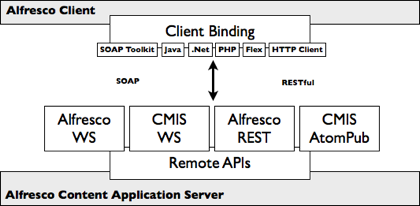

# Remote API

The Remote API is primarily used to build ECM solutions against the Alfresco content application server.

There are two styles of Remote APIs:

-   Web services - SOAP-based service-oriented interfaces
-   RESTful - HTTP-based resource-oriented interfaces

The Web services API has many tools for building client bindings, covering all of the common environments and programming languages. You can remotely interact with the Alfresco content application server through this interface from anywhere, such as Java, Microsoft .NET, PHP, and Adobe Flex. To ensure such compatibility, Alfresco embeds the Apache CXF engine and performs thorough integration testing. The Web services API also lends itself to orchestration through third-party business process engines, allowing the integration of content services into a wider business process.

The RESTful API is more recent and its scope has been expanding to cover all services of the Alfresco content application server. If you have an HTTP client you can communicate with Alfresco. It is also easy to use with AJAX-oriented web clients. Alfresco Share, a Spring Surf–based client, remotely communicates with the Alfresco content application server exclusively through its RESTful API. Behind the scenes, Alfresco embeds Spring web scripts for developing its RESTful API.

The Web services and RESTful APIs, although comprehensive, are proprietary APIs. A client implemented against these APIs can only execute against Alfresco, therefore locking out content that may reside in a content repository of another vendor.

CMIS addresses this by providing a standardized set of common services for working with content repositories, both Web service \(SOAP\) and RESTful–based. CMIS is not language-specific, it does not dictate how a content repository works, and it does not seek to incorporate every feature of every content repository. Alfresco provides an implementation of CMIS Web service and RESTful bindings, as well as a CMIS client API for use in Spring Surf and other environments.

**Parent topic:**[APIs](../concepts/api-about.md)

**Related information**  

[About CMIS](cmis-about.md)

