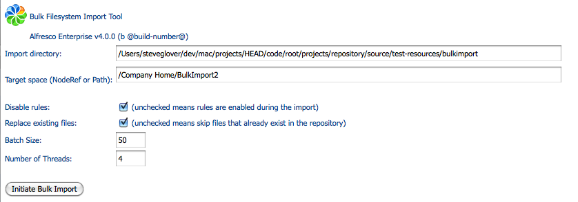
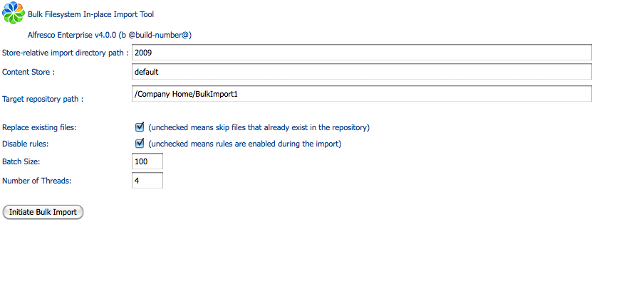
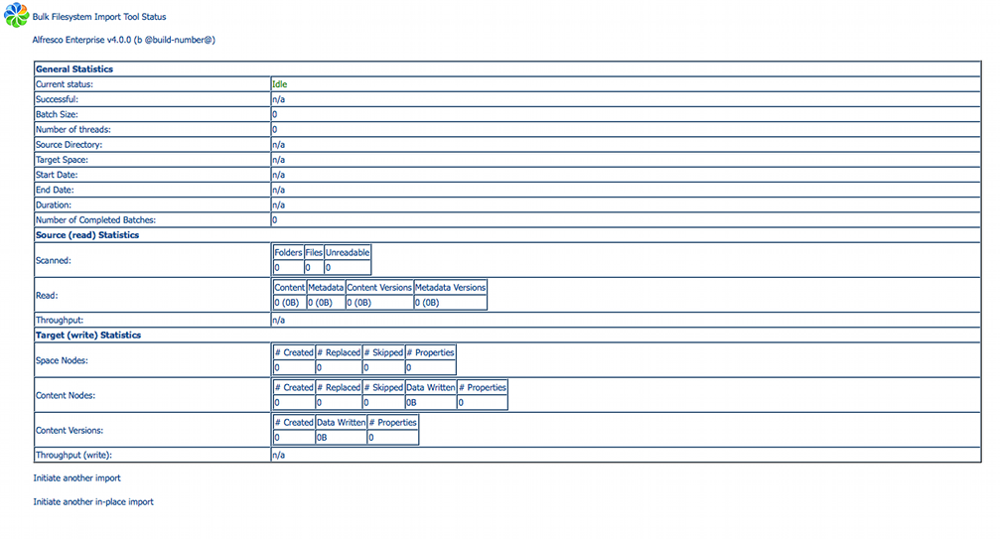
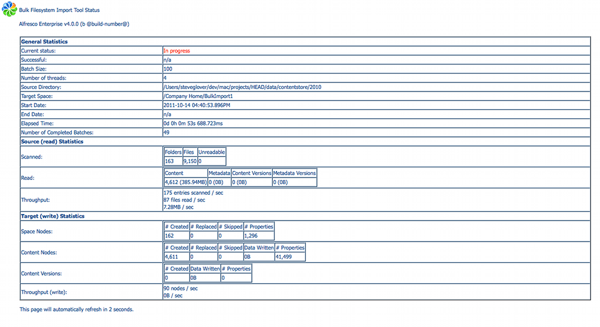
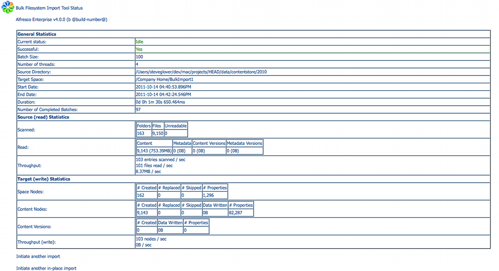

# Importing via the user interface

The two types of bulk import \(streaming and in-place\) each have a user interface, which are implemented using Alfresco webscripts.

## Streaming

Streaming bulk import is exposed in two webscripts:

1.  A simple UI webscript that can be used to manually initiate an import. This is an HTTP GET webscript with a path of:

    ```
    http://localhost:8080/alfresco/service/bulkfsimport
    ```

2.  An initiate webscript that kicks off an import using parameters that are passed to it \(for the source directory, target space, and so on\). If you want to script or invoke the tool programmatically, this is the webscript you call. This is an HTTP GET webscript with a path of:

    ```
    http://localhost:8080/alfresco/service/bulkfsimport/initiate
    ```


The UI webscript presents the following simplified HTML form:



-   The **Import directory** field is required and indicates the absolute file system directory to load the content and spaces from, in an OS-specific format. Note that this directory must be locally accessible to the server on which the Alfresco instance is running. It must either be a local file system or a locally mounted remote file system \(mounted using NFS, GFS, CIFS, or similar\).
-   The **Target space** field is also required and indicates the target space to load the content into, as a path starting with /Company Home. The separator character is Unix-style "/", regardless of the platform Alfresco is running on. This field includes an AJAX auto-suggest feature, so you may type any part of the target space name, and an AJAX search will be performed to find and display matching items.
-   The **Replace existing files** check box indicates whether to replace nodes that already exist in the repository \(checked\) or skip them \(unchecked\). Note that if versioning is enabled for a node, the node's existing content and metadata will be preserved as the prior version and the new content and/or metadata will be written into the head revision.
-   The **Number of Threads** text field allows you to override the default number of threads \(defined by the property `bulkImport.batch.numThreads`\) to use in the bulk import.
-   The **Batch Size** text field allows you to override the default batch size \(the number of directories and files to import at a time, per transaction; defined by the property `bulkImport.batch.batchSize`\) to use in the bulk import.
-   The **Disable rules** check box allows you to turn off rule processing during the bulk import.

## In-place

In-place bulk import is exposed in a series of two webscripts:

1.  A simple UI webscript that can be used to manually initiate an import. This is an HTTP GET webscript with a path of:

    ```
    http://localhost:8080/alfresco/service/bulkfsimport/inplace
    ```

2.  An initiate webscript that kicks off an import, using parameters that are passed to it \(for the source directory, target space, and so on\). If you want to script or programmatically invoke the tool, this is the webscript you call. This is an HTTP GET web script with a path of:

    ```
    http://localhost:8080/alfresco/service/bulkfsimport/inplace/initiate
    ```


The in-place UI webscript presents the following simplified HTML form:



-   The **Store-relative import directory path** field is required and indicates the file system path for loading content and spaces, relative to the content store, in an OS-specific format. Note that this directory must be locally accessible to the server the Alfresco instance is running on - it must either be a local file system or a locally mounted remote file system \(mounted using NFS, GFS, CIFS or similar\). This directory must already be inside an existing content store.
-   The content store name that holds the content, as defined within the storage configuration \(content store selector or direct fileContentStore\). The default store is by default named "default". An autocomplete popup will assist in selecting the name as the first characters are entered. The **Up** and **Down** keyboards keys can be used to navigate the list, in addition to the mouse.
-   The **Target space** field is also required and indicates the target space to load the content into, as a path starting with "/Company Home". The separator character is Unix-style "/", regardless of the platform Alfresco is running on. This field includes an AJAX auto-suggest feature, so you may type any part of the target space name, and an AJAX search will be performed to find and display matching items.
-   The **Replace existing files** check box indicates whether to replace nodes that already exist in the repository \(checked\) or skip them \(unchecked\). Note that if versioning is enabled for a node, the node's existing content and metadata will be preserved as the prior version and the new content and/or metadata will be written into the head revision.
-   The **Number of Threads** text field allows you to override the default number of threads \(defined by the property `bulkImport.batch.numThreads`\) to use in the bulk import.
-   The **Batch Size** text field allows you to override the default batch size \(the number of directories and files to import at a time, per transaction; defined by the property `bulkImport.batch.batchSize`\) to use in the bulk import.
-   The **Disable rules** check box allows you to turn off rule processing during the bulk import.

The status web page is the same for both streaming and in-place import. It displays as follows:



## Bulk import status

The bulk import status webscript returns status information on the current import \(if one is in progress\), or the status of the last import that was initiated. This webscript has both HTML and XML views, allowing external programs to programmatically monitor the status of imports. This is an HTTP GET webscript with a path of:

```
http://localhost:8080/alfresco/service/bulkfsimport/status
```

The status web page is the same for both streaming and in-place import. The status is updated every five seconds when a bulk import has been initiated, as follows.



When the bulk import has completed, it displays as follows:



**Parent topic:**[Using the Bulk Import tool](../concepts/Bulk-Import-Tool.md)

