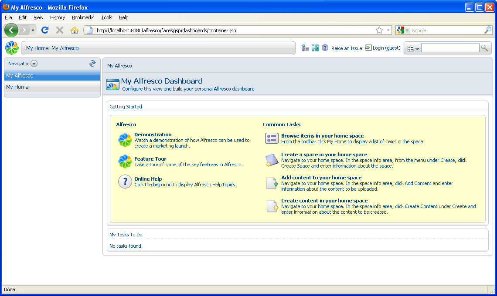

# Starting with Explorer

Take a moment to familiarize yourself with the main page of the application.

When you open your browser to Alfresco for the first time, you are taken to the **My Alfresco Dashboard** space. This space can be used to hold any content that you would like to be available to anyone who has access to your Alfresco server.

There are three main areas in the Alfresco user interface:

-   Toolbar along the top

-   Sidebar at the left

-   Working area at the right

-   **[Toolbar](../concepts/cgs-toolbar.md)**  
The toolbar contains navigation buttons, which vary depending on who you are.
-   **[Sidebar](../concepts/cgs-sidebar.md)**  
The Sidebar contains a number of different features to help you navigate, find, and work with content.
-   **[Working area](../concepts/cgs-workarea.md)**  
The working area is a dynamic area displaying items relevant to the task you are performing.
-   **[Logging in](../tasks/tgs-login.md)**  
To add and create content in Alfresco, you must log in. When Alfresco is installed, it creates an administration user called *admin* with a default password of *admin*. The **Password**field is case sensitive.

**Parent topic:**[Getting Started with Alfresco Explorer Document Management](../concepts/cgs-intro.md)

