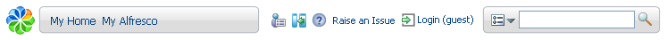

# Toolbar

The toolbar contains navigation buttons, which vary depending on who you are.

If you are logged in as:

-   **Guest**: You have access to the My Home space and the **My Alfresco Dashboard**.
-   **User**: You also have access to the Company Home and Guest Homespaces.
-   **Administrator**: You also have access to the **User Profile** and the **Administration Console** features.

The toolbar also lets you:

-   Access the Search and Help features

-   Hide and show the Sidebar \(click \)

-   View information about Alfresco CMS \(click the Alfresco logo\)

**Parent topic:**[Starting with Explorer](../concepts/cgs-starting.md)

