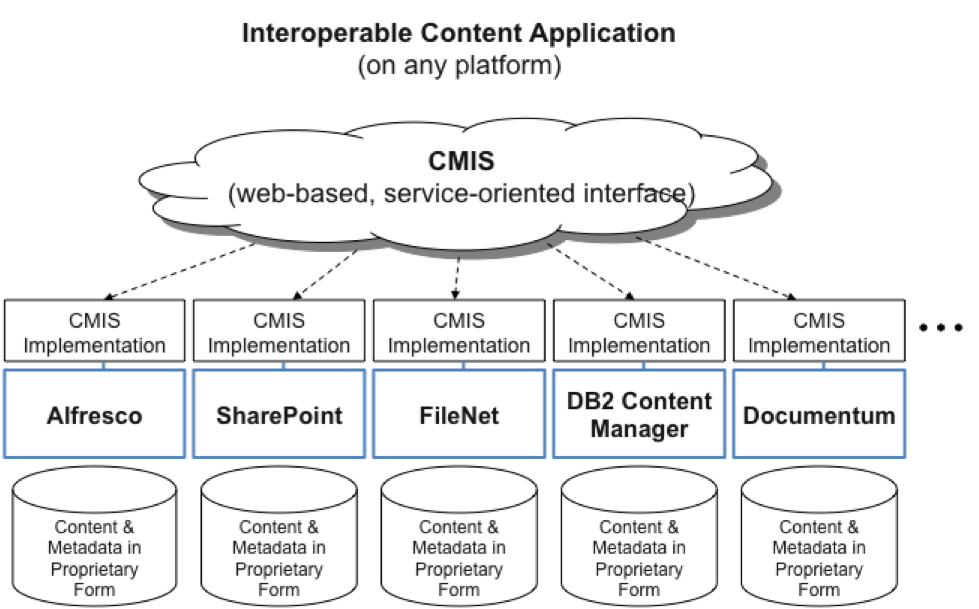

# Programming with CMIS

Content Management Interoperability Services \(CMIS\) is an OASIS standard designed for the ECM industry. CMIS enables access to any content management systems that implement CMIS, such as Microsoft SharePoint, IBM FileNet, EMC Documentum, and Alfresco in a standardized and interoperable way.

CMIS allows you to build applications that are not locked into any content management system and to future-proof those applications. It provides a rich set of functionality, yet is capable of handling a wide variety of content management systems. CMIS provides a set of content services for managing content metadata, versioning, folder containment, associations, and binary transfer, and a query language based upon SQL querying content, its metadata, and context.

-   **[Using CMIS with Alfresco](../concepts/cmis-and-alfresco.md)**  
The Alfresco CMIS implementation is the basis for many existing CMIS applications, and you can use CMIS too to integrate your application with Alfresco. Most applications that use CMIS opt for the simpler AtomPub protocol rather than the SOAP protocol. However, if your application has a strong web services framework you may want to use the SOAP bindings.
-   **[CMIS requirements](../concepts/cmis-requirements.md)**  
CMIS uses web protocols to access the repositories and supports SOAP and REST through the AtomPub protocol.
-   **[CMIS repository](../concepts/cmis-concepts.md)**  
 At the root of the CMIS model and services is a repository, which is an instance of the content management system and its store of metadata, content, and indexes.
-   **[CMIS query](../concepts/cmis-query.md)**  
A CMIS query is based upon SQL-92. The query is read-only and presents no data manipulation capabilities.
-   **[CMIS services](../concepts/cmis-services-about.md)**  
CMIS provides services that you can access using SOAP or AtomPub, depending on your preferred architectural style.
-   **[CMIS object model](../concepts/cmis-objects.md)**  
The CMIS object model is similar to the Alfresco object model minus the support of aspects. It supports versioning, policy, document, and folder objects.
-   **[The Alfresco OpenCMIS Extension](../concepts/opencmis-ext-intro.md)**  
 The Alfresco OpenCMIS Extension extends OpenCMIS to provide support for Alfresco aspects.

**Parent topic:**[Programming with Alfresco](../concepts/programming-intro.md)

