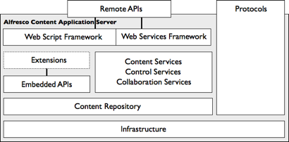

# Alfresco content application server

At the heart of the Alfresco system is the content application server, which manages and maintains the content repository. The server's primary responsibility is to provide services for use in building ECM solutions. All the applications of the Alfresco ECM suite are built upon and executed by the content application server.

The Alfresco content application server exposes a set of remote public interfaces for allowing a client to communicate with it. The remote public interfaces are the only part of the server visible to the client. There are two types:

-   **Remote APIs** - for interacting with services of the server programmatically
-   **Protocol bindings** - for mapping services for use by a protocol-compliant client

Internally, the server comprises several layers. The foundation includes infrastructure concerns, such as configuration, authentication, permissions, and transactions that cut across all capabilities. Infrastructure also shields the server from being tied to any specific environmental implementation, such as transaction managers or caching mechanisms.

The content repository is built on this infrastructure, which itself is the building block for content, control, and collaboration services. Each capability of the content repository and content services is individually bundled as a module with its own in-process interface and implementation. Modules are bound together by the infrastructure through their interfaces.

You can deploy extensions to the content application server to extend or override its capabilities. Their implementation may use the in-process interfaces offered by the content repository and content services.

**Parent topic:**[Architecture](../concepts/alfresco-arch-about.md)

