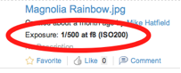

# Client-side template and action extensions

Two new global events have been introduced to make it easier to add new metadata template renderers and client-side action handlers.  

## Metadata template renderer

Custom client renderers are registered with the Document Library using the new “**registerRenderer**” Bubbling event.

Ensure the client-side assets are loaded onto the page using the DocLibCustom / dependencies configuration section.

Using the example to add a new EXIF metadata renderer to produce the output as follows.



Giving the renderer an id of “exposure” also extends the metadata templates using a custom line config:

```
<line index="20" id="exposure">{exposure exif.label.exposure}</line>       
```

The JavaScript to register the custom renderer is then simply as follows. Note the event name, the event property names and where the custom renderer id is specified.

```
YAHOO.Bubbling.fire("registerRenderer",
{   
  **propertyName**: "**exposure**",
  **renderer**: function exif_renderer(record, label)
  {      
  ...      
     return html;
  }
  });
```

See [EXIF renderer source code](EXIF-renderer-source-code.md#) for the complete source for this example.

## Custom action handler

In a very similar way to metadata renderers, new client-side actions are registered using the **registerAction** Bubbling event message.

```
YAHOO.Bubbling.fire("**registerAction**",
{   
  **actionName**: "**onActionPreviewWebAsset**",
  **fn**: function WCMQS_onActionPreviewWebAsset(record)
  {      
  ...      
  }
});
```

A full example of this can be found in the modules/wcmquickstart/wcmquickstartsharemodule project within the main Alfresco SVN repository.

**Parent topic:**[Extending the Alfresco Share Document Library](../concepts/Share-Doclib-Extend-Intro.md)

