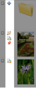
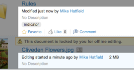
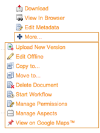

# Alfresco Share Document Library web tier

In versions of Alfresco Share previous to 4.0, the client-side JavaScript requested JSON data from the repository directly via the proxy servlet. From v4.0, there is a new data web script \(at/components/documentlibrary/data/\) thst requests data from the repository and processes the response based on a configurable set of evaluators before finally returning JSON data to the browser.

All configuration for, and evaluation of, Document Library status indicators, metadata templates, and actions is now on the web tier instead of split between the repository and the browser.

## 1. Web tier configuration overview

The individual action configuration files \(e.g. documentlist.get.config.xml, document-details.get.config.xml\) have been removed and all actions are now defined within common, easily over-ridable config sections.

The new or altered areas of configuration in **share-documentlibrary-config.xml** are:

|
|`DocumentLibrary`|-   Updated for Version 4.0
-   New `<indicators>` section for configuring status indicators
-   New `<metadata templates>` for configuring the metadata displayed within the Document Library's "browse" view

|
|`DocLibCustom`|-   New to Version 4.0
-   `<dependencies>` section for defining custom client-side functionality and stylesheets

|
|`DocLibActions`|-   New to Version 4.0
-   `<actions>` section defining all available actions across the various Document Library view pages
-   `<actionGroups>` that define which \(and in what order\) actions are to appear on the Document Library pages

|

Also new to v4.0 is the **slingshot-documentlibrary-context.xml** file containing all bean definitions for web tier evaluators.

## 2. Status indicators

|
||-   Defined within the **DocumentLibrary** config section, status indicators are small icons typically used to indicate the presence of a marker aspect, or whether a document is in a particular state, e.g. checked out for editing.
-   Indicator images by default are referenced by id: */res/components/documentlibrary/indicators/\{id\}-16.png* unless the name is overridden by the “icon” attribute.
-   Tooltip labels are also defaulted by id: *status.\{id\}* and can be overridden by the “label” attribute.

|

The status indicators are located in the `<indicators>` config container element with the following structure:

```
<indicator id (index) (icon) (label)>
    <evaluator />
    <labelParam index />
    <override />
</indicator>
```

where:

|
|`<indicator>`|Status indicator element with the following attributes: -   id: Unique indicator id
-   index: Determines display order of this indicator
-   icon: Icon filename; if not specified, "id" is used
-   label: Tooltip i18 label; if not specified, "id" is used

|
|`<evaluator>`|Bean id of evaluator that determines the visibility of the image. The Evaluator extends `org.alfresco.web.evaluator.BaseEvaluator`|
|`<labelParam>`|Allows placeholder values within i18n label to be replace at runtime with node properties. The value is the replacement string or dot notation path to a node property. The attribute is:-   index: Index of placeholder value with i18n message

|
|`<override>`|Allows this indicator to override \(hide\) other indicators that would otherwise be visible. The value is the id of another indicator to override.|

**Example config**

```
<indicator id="google-docs-locked" index="10">
    <evaluator>evaluator.doclib.indicator.googleDocsLocked</evaluator>
    <labelParam index="0">{jsNode.properties.owner.displayName}</labelParam>
    <labelParam index="1">{jsNode.properties.owner.userName}</labelParam>
    <override>locked</override>
</indicator>
```

A note about the `labelParam` value: refactoring on the client-side \(JavaScript code\) means that a common helper object is available for each node within the Document Library during the rendering cycle, namely `jsNode`. A full reference for this new resource is in [jsNode reference.](doclib-jsNode-reference.md)

## 3. Metadata templates

The metadata template refers to the section of the document “browse” page under the filename. New functionality in Version 4.0 allows this area to be customized with node properties and/or by custom rendering functions.



In a clean install, there are two templates defined: the **default** \(fallback\) template and one used when rendering working copies. These are both defined within **share-documentlibrary-config.xml** and can be extended or overridden as required \(via **share-config-custom.xml**\).

The metadata templates are located in the `<metadata-templates>` config container element with the following structure:

```
<template id>
    <evaluator />
    <line id (index) (simpleView) (evaluator) />
    <override />
</template>
```

where:

|
|`<template>`|Template element with the following attribute: -   id: Unique template id

|
|`<evaluator>`|Bean id of evaluator that determines whether the template is to be used for this node or not. The Evaluator extends `org.alfresco.web.evaluator.BaseEvaluator`|
|`<line>`|Allows placeholder values within i18n label to be replace at runtime with node properties. The value refers either to a node property \(such as `cm_description`\) or a customer JavaScript renderer. To add a label in front of the property, add the label's i18n messageId after the property value, separated by a space \(such as \{`cm_description details.description`\}. The attributes are:-   id: Id of the line within the template. Must be unique within this template.
-   index: Optional index for ordering the lines when rendering.
-   view: If set to "simple" or "detailed", then this line will only be rendered when either the simple or detailed view is toggled on, respectively. Leave empty, or omit the attribute for both views.
-   evaluator: Optional evaluator to determine whether this line will be rendered for a node when using the template.

|

**Example config**

```
<template id="isPhoto">
   <evaluator>evaluator.doclib.metadata.hasExif</evaluator>
   <line index="10" id="date" view="detailed">{date}{size}</line>
   <line index="20" id="exposure" evaluator="evaluator.doclib.metadata.hasExposure">
      {exposure exif.label.exposure}
   </line>
   <line index="30" id="description" view="detailed">{description}</line>
   <line index="40" id="social" view="detailed">{social}</line>
</template>
```

**Custom JavaScript renderers**

A renderer can either be a simple property value, or use a custom JavaScript renderer. To register a custom renderer, fire a Bubbling \(global\) event, passing-in the renderer id and the rendering function:

```
if (Alfresco.DocumentList)
{  
    YAHOO.Bubbling.fire("registerRenderer",   
    {      
        propertyName: "renderer id",      
        renderer: function(record, label)      
        {         
           return "...";      
        }   
    });
}
```

The rendering function should return property escaped HTML.

**Note:** See section on custom client assets.

## 4. Actions

In versions previous to v4.0, the actions configuration was spread throughout a number of web script XML config files. From v4.0, actions are all now defined globally in the **share-documentlibrary-config.xml** file, in the `DocLibActions` config section. This means they can be overridden and extended via a **share-config-custom.xml** file. These customizations can be via AMP, JAR or web-extension folder mechanism, or a mixture of all three.

Actions are also now grouped by view type instead of node “state”.



The actions are located in the `<actions>` config container element with the following structure:

```
<action id type (icon) label>
    <param name />
    <evaluator negate />
    <permissions>
      <permissions allow />
    </permissions>
    <override />    
</action>        
```

where:

|
|`<action>`|Action config container element with the following attributes: -   id: Unique action id
-   type: Action type. Currently supported are: javascript, link, pagelink
-   icon: Optionally, override the icon name. If not set, the id is used
-   label: The action's i18n message id

|
|`<param>`|Action parameter elements with the following attribute:-   name: Parameter name

|
|`<evaluator>`|Bean id of evaluator that determines whether the action is valid for this node or not. Evaluator extends `org.alfresco.web.evaluator.BaseEvaluator` and contains the following attribute:-   negate: If set to "true", the output of the evaluator is inverted

|
|`<permissions>`|Permission config container element|
|`<permission>`|List of permissions required for the actions, as defined in the `applicationScriptUtils` bean config with the following attributes:-   allow: If the permission specifies, the action is allowed
-   deny: If the permission specifies, the action is hidden

Only one of the "allow" or "deny" permissions can be specified

|
|`<override>`|If this action should override the visibility of other actions, they are specified using this element.|

**Example config**

```
<!-- Inline edit -->
<action id="document-inline-edit" type="pagelink" label="actions.document.inline-edit">   
   <param name="page">inline-edit?nodeRef={node.nodeRef}</param>
   <permissions>
     <permission allow="true">Write</permission>   
   </permissions>  
   <evaluator>evaluator.doclib.action.inlineEdit</evaluator>
   </action>
```

```
<!-- Checkin from Google Docs -->
<action id="document-checkin-from-googledocs" type="javascript" label="actions.document.checkin-google">
     <param name="function">onActionCheckinFromGoogleDocs</param>  
     <evaluator>evaluator.doclib.action.googleDocsCheckIn</evaluator>  
     <override>document-checkout-to-googledocs</override>
     </action>
```

```
<!-- View in Explorer client -->
<action id="view-in-explorer" type="link" label="actions.folder.explorer-view">
  <param name="href">{explorerViewUrl}</param>
  <param name="target">_blank</param>  
  <evaluator>evaluator.doclib.action.viewInExplorer</evaluator>
</action>
```

## 5. Action groups

Actions are grouped using the `actionGroup` elements. The type of node and also the view currently in use determines the actual group used. The group is calculated by the `calculateActionGroupId()` function in surf-doclist.lib.js and is designed to be overridden if many new and/or altered actions are required .

The action groups defined in a default installation are:

|
|**Action Group id**|**Default Usage**|
|document-browse|Documents on the browse page|
|document-details|Document on the document details page|
|folder-browse|Folders on the browse page|
|folder-details|Folders on the folder details page|
|document-link-browse|Links to documents on the browse page|
|document-link-details|Links to folders on the document details page|
|folder-link-browse|Links to folders on the browse page|
|folder-link-details|Links to folders on the folder details page|
|

The action groups are located in the `<actionGroups>` config container element with the following structure:

```
<actionGroup id>
    <action />  
</actionGroup>        
```

where:

|
|`<actionGroup>`|Action group config container element with the following attribute: -   id: Unique action group id

|
|`<action>`|Action element with the following mandatory attribute:-   id: Reference to action as defined in `<actions>` config section

|
|

Other actions properties are over-ridable here, although it is recommended from a maintenance view to only override "simple" properties like the icon and label. These make it possible to reuse an action with document-biased icon and label to be used for folders.

**Example config**

```
<actionGroup id="folder-browse">
    <action index="100" id="folder-view-details" />  
    <action index="110" id="folder-edit-properties" icon="folder-edit-properties" />
label="actions.folder.edit-metadata" />
</actionGroup>        
```

## 6. Custom client extensions

The `DocLibCustom` config section is where dependencies on custom client-side assets can be defined. These are defined in exactly the same way as for custom Forms dependencies.

The client-side dependencies are located in the `<dependencies>` config container element with the following structure:

```
<css src />  
<js src />        
```

where:

|
|`<css>`|Stylesheet dependencies element with the following attribute: -   src: Path to the css file, relative to the/res servlet

|
|`<js>`|JavaScript dependencies element with the following attribute: -   src: Path to the js file, relative to the/res servlet

|
|

Other actions properties are over-ridable here, although it is recommended from a maintenance point of view to only override "simple" properties like the icon and label. These make it possible to reuse an action with documen-biased icon and label to be used for folders.

**Example config**

```
<dependencies>
    <cs src="/custom/my-customization.css" />  
    <js src="/custom/my-customization.js" /> 
</dependencies>        
```

**Parent topic:**[Extending the Alfresco Share Document Library](../concepts/Share-Doclib-Extend-Intro.md)

