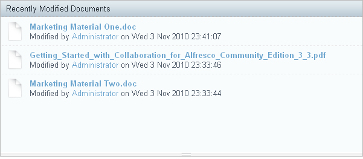
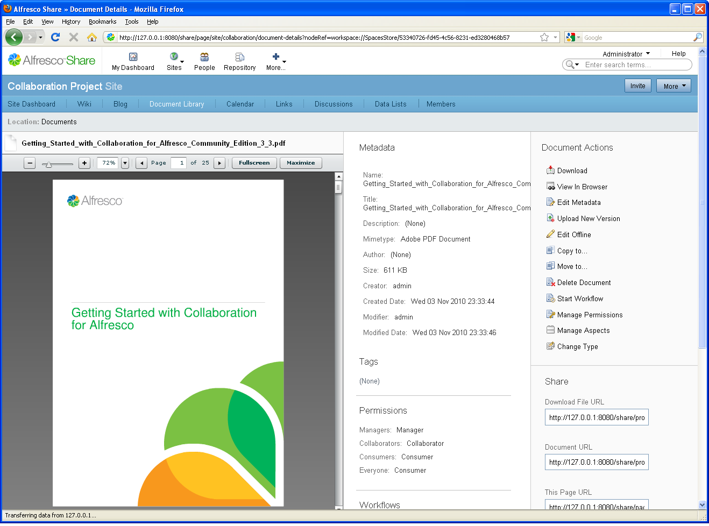
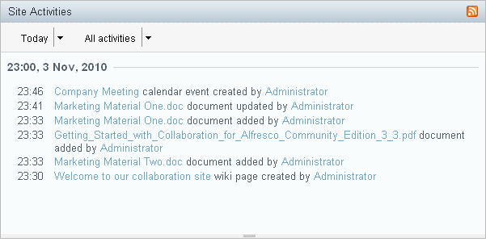

# View activities within your site

Now that you have prepared your site and invited your users, you can return to the site dashboard and see the specific activities that occurred and documents that were modified within the site.

The Recently Modified Documents dashlet displays the documents added and updated in the past seven days.

On this dashlet you can:

-   Click the document name to display a detailed preview of the document.

    

-   From the preview, click the link in the **Location** path to access the library folder in which this document resides.

The Site Activities dashlet displays the most recent activities that have been performed in this site.

-   In this dashlet, select the **All activities** view.

-   Use the resizing bar along the bottom of this and many other dashlets to adjust the height of the dashlet as desired. The height preferences are maintained between sessions.

On the Site Activities dashlet you can:

-   Click an event to display the scheduled event in the Month view of the Calendar page component.
-   Click a new or updated wiki page to display the page in the Wiki page component.
-   Click the name of the user responsible for an activity to view their user profile.

**Parent topic:**[Getting Started with Alfresco Share Collaboration](../concepts/gs-intro.md)

