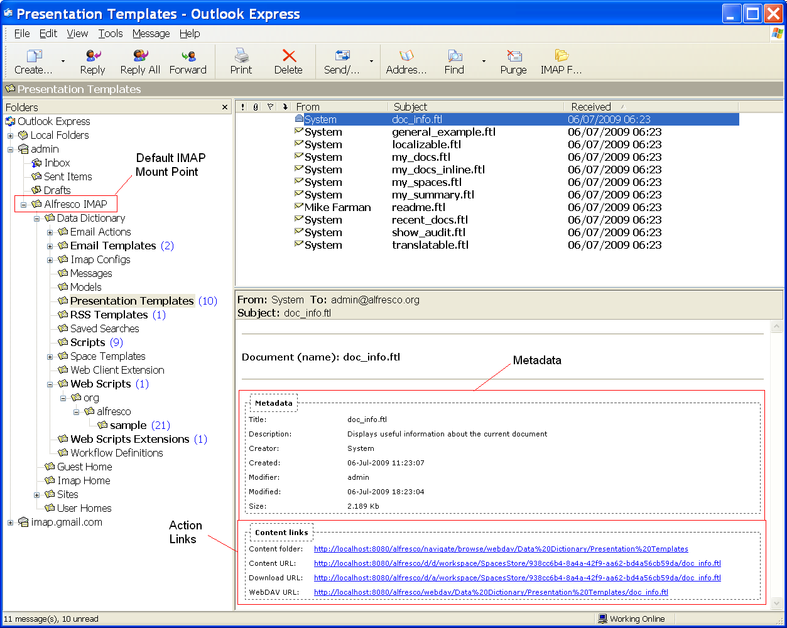

# Virtual view email format

The virtualized view uses presentation templates to generate the mail body and display document metadata, action links \(for download, view, webdav, folder\) and Start Workflow form \(HTML view only\).

The templates are stored in the repository in Company Home \> Data Dictionary \> Imap Configs \> Templates. Separate templates are available to generate either a HTML or plain text body, based on the format request by the email client. The templates can be customized to change the metadata and actions available in the email body.

**Parent topic:**[Configuring IMAP Protocol support](../concepts/imap-intro.md)

