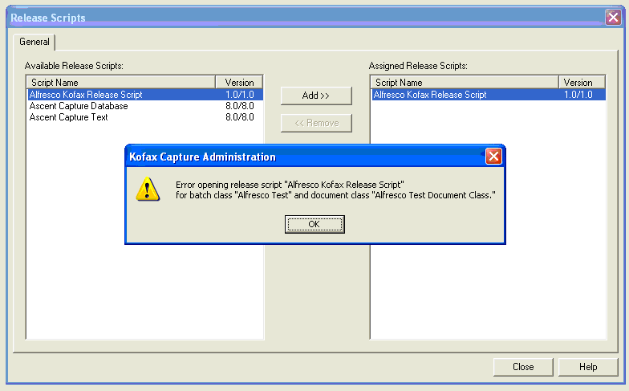

# Troubleshooting the Kofax Release script

This section describes how to troubleshoot the Kofax Release script.

**Parent topic:**[Installing and configuring Alfresco Kofax Release script](../concepts/kofax-intro.md)

## Error adding the Alfresco Kofax Release script to a document class

If you see an error message “Error opening release script “Alfresco Kofax Release Script" when adding the script to a document class, it may be an indication that you have not copied the binaries to your Kofax Capture bin directory.

Ensure that the following files are in the bin directory:

-   Alfresco.Kofax.Release.Core.dll
-   Alfresco.Kofax.Release.Core.Logging.xml
-   Alfresco.Kofax.Release.Core.xml
-   Alfresco.Kofax.Release.inf
-   Alfresco.Kofax.Release.WebScripts.dll
-   Antlr.runtime.dll
-   Common.Logging.dll
-   Jayrock.Json.dll
-   log4net.dll
-   Spring.Core.dll

## Release Error: \[Release Script Returned -1. Your release script may need to be re-installed.\]

This is a generic Kofax error. The most likely cause is that an invalid working folder has been specified when setting up the release.

Ensure that you have entered a valid folder path in the **Working Folder** field on the General tab.

Other causes of this error include missing dependencies in the installation. Check that you have installed all the required files the bin directory.

