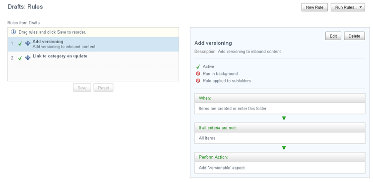

# Working with a defined rule set

You can easily view and maintain the individual rules that makes up the rule set. You can add, edit, and delete rules, make a rule inactive, and change the run order. You can also manually run rules.

When you select the **Manage Rules** action for a folder with defined rules, the Rules page looks like this:

The left side of the page lists the rules that make up the rule set. If the folder inherits rules from a parent folder, those rules appear here too. The rules run in the order they're listed. Inherited rules are always run first.

A check mark to the left of the rule means it's active.

Selecting an individual rule in this list displays its details on the right side of the page.

-   **[Adding a new rule](../tasks/library-folder-rules-new.md)**  
A rule set can include any number of individual rules, and you can add new rules to a folder as you need.
-   **[Editing a rule](../tasks/library-folder-rules-edit.md)**  
You might need to revisit your rules from time to time and make some changes to keep them current. If you don’t want to use a specific rule anymore but think you may need it again in the future, you can just disable it.
-   **[Deleting a rule](../tasks/library-folder-rules-delete.md)**  
When folder contains a rule you don't need anymore, you can delete the individual rule.
-   **[Reordering the rules in the rule set](../tasks/library-folder-rules-reorder.md)**  
As part of managing your rule set you can pick the order Alfresco runs the rules. If your folder has inherited rules, those are always run first in the order they're listed. Any rules marked as inactive are simplly skipped.
-   **[Manually running rules](../tasks/library-folder-rules-run.md)**  
When you create or edit a rule set, the rules aren't automatically applied to the existing folder items. You can manually run the rules at any time to apply them to all content. Only the items that meet the conditions will be affected.

**Parent topic:**[Managing rules](../tasks/library-folder-rules-manage.md)

