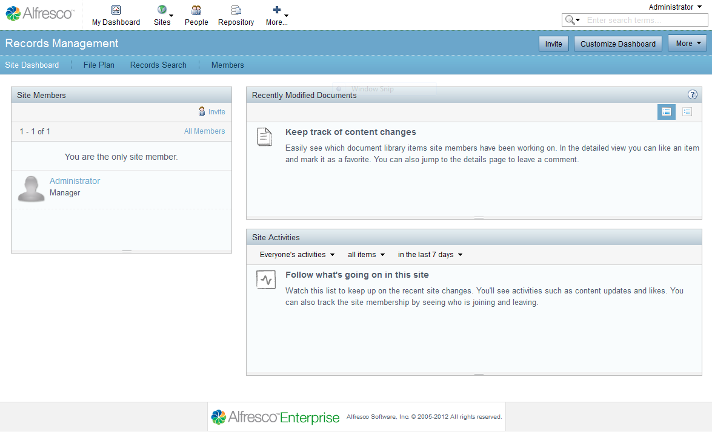

# Records Management site

The Records Management site dashboard is an interactive user interface that contains information specific to the site. It consists of dashlets that let you to track the activities that are relevant to the records management life cycle.

**Parent topic:**[Records Management site dashboard](../concepts/rm-gettingstarted.md)

