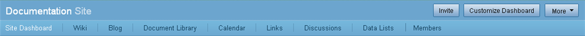

# The site dashboard

A site is a collaborative project area where users can share and collaborate on content.

When you navigate to a site, the site dashboard is displayed.

Beneath the application toolbar the banner displays the site name. The site manager uses the buttons to the right—**Invite**, **Customize Dashboard**, and **More**—to set up and then manage the site.

**Note:** For users with a role other than site manager, the banner displays only an **Actions** button.

Sites are made up of different components, or pages, which are listed beneath the site name on the navigation bar. By default a new site includes only a library though a site manager can customize the site to contain any combination of pages, including a wiki, a blog, a calendar, a discussion forum, web links, and data lists. The current page appears highlighted so your location in the site is always obvious.

The navigation bar also includes the **Members** link for managing the site membership.

Just like your personal dashboard, the site dashboard consists of dashlets, referred to as site dashlets. These organize and display information that is relevant to the site. The site manager customizes the site dashboard to display the desired dashlets; each dashlet selected appears as a pane on the dashboard.

A new site includes the following dashlets:

-   **Site Members**

    The Site Members dashlet lists the current members of this site \(to a maximum of 100 members\) and their assigned roles. The **Invite** action is available on this dashlet to site managers.

-   **Recently Modified Documents**

    The Recently Modified Documents dashlet lists the content in this site's library that has been added or edited in the past seven days. You can choose a simple or detailed view for this dashlet. In the detailed view, you see extra features that let you like an item and mark it as a favorite. You can also jump to a page where you can read and add comments.

-   **Site Activities**

    The Site Activities dashlet tracks the most recent activities that have been performed in this site. Filters let you decide whose activites you see \(everyone's, yours, or other users'\), which type of activities you see \(all, status updates, comments, content, or memberships\), and for what time period. These preferences are saved between sessions. An RSS feed is offered on this dashlet; subscribe to the feed to automatically receive the activity updates.

Other dashlets are also available:

-   **Site Profile**

    The Site Profile dashlet contains a summary of the site details.

-   **Site Calendar**

    The Site Calendar dashlet shows the upcoming events scheduled for this site.

-   **Wiki**

    The Wiki dashlet displays a selected page from the site wiki. Click the name of the wiki page in the dashlet header to navigate to that page in the wiki. An edit action is available to the site manager to change the page.

-   **Site Links**

    The Site Links dashlet displays the web links compiled by site users.

-   **Image Preview**

    The Image Preview dashlet displays a thumbnail of all images contained in the site's library. You can also download an image directly from the dashlet.

-   **Web View**

    The Web View dashlet can be configured to display any website. Use the Configure action in the dashlet title to change the website.

-   **RSS Feed**

    By default the RSS Feed dashlet displays the Alfresco website feed. Use the Configure action in the dashlet title to change the RSS feed.

-   **Alfresco Add-ons RSS Feed**

    By default the Alfresco Add-ons RSS Feed dashlet displays the Newest Add-ons feed from the Alfresco Add-ons website. Use the Configure action in the dashlet title to change the RSS feed.

-   **Site Data Lists**

    The Site Data Lists dashlet displays a list of the existing data lists for the current site. Click the name of a list in this dashlet to display that list.

-   **Web Quick Start**

    The Web Quick Start dashlet enables you to use the Web Quick Start sample web application. The dashlet initially displays a link that imports the Web Quick Start demo data. Once the import is complete, the dashlet displays a link to the Web Quick Start online help. This dashlet is available only when the Web Quick Start demo is installed.

Most dashlets can be resized by a site manager. Click and drag the resizing bar on the bottom edge of a dashlet until it is the height you want. This preference is saved so the site dashboard displays to all users the way that you configure it.

-   **[Marking the current site as a favorite](../tasks/sites-favourites-menu.md)**  
Marking a site as a favorite places it in the My Favorites list in the **Sites** menu so that you can quickly access it from anywhere in the application. You can tag any number of sites this way.
-   **[Customizing a site](../tasks/site-customize.md)**  
Once you create a site you can customize it to ensure it meets your needs in terms of content and design.
-   **[Customizing a site dashboard](../tasks/site-customize-dashboard.md)**  
The site dashboard is an interactive user interface that contains information specific to the current site. Like your personal dashboard, site information is organized and displayed in dashlets.
-   **[Editing the site details](../tasks/sites-edit-details.md)**  
Once you create a site you can edit the name and description from anywhere in the site. You can also change the access \(public or private\) for the site.
-   **[Using the site dashlets](../concepts/sites-dashlet-use.md)**  
Once you navigate to a site dashboard you can view information and perform functions on the dashlets just as you do on your personal dashboard.
-   **[Tagging site content](../tasks/site-content-tag.md)**  
You can use tags to categorize similar or related content within a site. This enables you to easily locate the content again.
-   **[Selecting a component](../tasks/page-select.md)**  
Within a site the navigation bar on the dashboard banner displays the components that make up the site. Use these links to move around the site to explore, contribute, and collaborate on site content.

**Parent topic:**[Using Alfresco Share](../topics/sh-uh-welcome.md)

