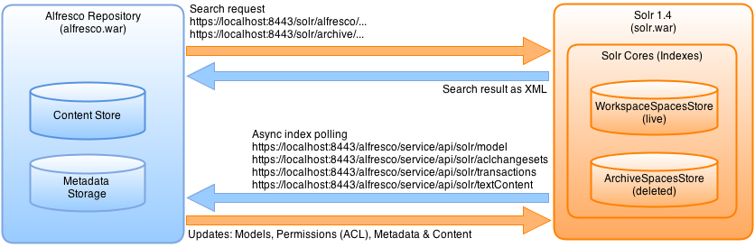

# Solr overview

Alfresco supports use of the Solr Enterprise search platform for searching within the Alfresco repository. Also, the existing embedded Lucene index remains available.

Solr is an open source enterprise search platform that uses lucene as indexing and search engine. Solr is written in Java and runs as a standalone search server. Alfresco sends HTTP and XML input to Solr and searches for content. Solr updates the cores or indexes and returns the result of the query in XML or JSON format.

**Note:** To confirm which application servers Alfresco supports for running the Solr application on, see the [Supported Platforms](http://www.alfresco.com/services/subscription/supported-platforms) matrix for your version of Alfresco.

There are two cores or indexes in Solr version 1.4:

-   **WorkspaceSpacesStore**: used for searching all live content stored at alfresco/alf\_data/contentstorewithin the Solr search server.

-   **ArchiveSpacesStore**: used for searching content that has been marked as deleted at alfresco/alf\_data/contentstorewithin the Solr search server.

**Note:** Alfresco only supports Solr version 1.4, so any latest version of Solr \(for example Solr 3.6.1\) will not be supported by Alfresco.

**Note:** Solr is the default search mechanism for new installations installed with the Setup Wizard. Also, the Solr server is supported only when running in a Tomcat application server. Therefore, if you are running Alfresco within a different application server and you wish to use Solr search, you must install Tomcat.

-   **[Advantages of Solr search over Lucene search](../concepts/solr-benefits.md)**  
Solr provides improvements on the search capabilities within Alfresco over the embedded Lucene index that improved the performance, scalability, and general support and configuration.
-   **[Eventual Consistency](../concepts/solr-event-consistency.md)**  
Alfresco 4 introduces the concept of eventual consistency to overcome the scalability limitations of in-transaction indexing.
-   **[When not to use Solr](../concepts/solr-choosing.md)**  
Solr can be used for search in Alfresco but it is not appropriate to use it for some functionality.

**Parent topic:**[Configuring Search](../concepts/solr-home.md)

