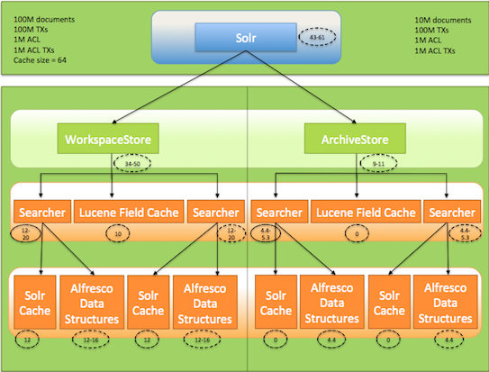

# Calculate the memory needed for Solr nodes

Solr can have high memory requirements. This topic describes the formula to calculate the memory needed for the Alfresco internal data structures used in Solr for PATH queries and read permission enforcement.

By default, there are two cores in Solr: WorkspaceSpacesStore and ArchiveSpacesStore. Normally, each core has one searcher but can have a maximum of two searchers.

In the calculation below:

-   N = refers to the number of nodes in the store. Each core's value is calculated separately. If there are more than two cores, you will need to add additional queries to calculate the value for that core \(as shown in the example code block below\).
-   T = refers to the number of transactions in the repository and this is same for each core
-   A = refers to the number of ACLs in the repository and this is same for each core
-   X = refers to the number of ACL transactions in the repository and this is same for each core

The values for N, T, A and X come from the database. Use the following commands to derive these values:

```
select * from
(select count( * ) N_Alfresco from alf_node where store_id = (select id from alf_store where protocol = 'workspace' and identifier = 'SpacesStore')) as N1 ,
(select count( * ) N_Archive from alf_node where store_id = (select id from alf_store where protocol = 'archive' and identifier = 'SpacesStore')) as N2 ,
(select count( * ) T from alf_transaction ) as T,
(select count( * ) A from alf_access_control_list ) as A,
(select count( * ) X from alf_acl_change_set) as X;
```

For example, if there are three cores, include additional queries to calculate the value for that core, as shown below:

```
select * from
(select count( * ) N_Alfresco from alf_node where store_id = (select id from alf_store where protocol = 'workspace' and identifier = 'SpacesStore')) as N1 ,
(select count( * ) N_Archive from alf_node where store_id = (select id from alf_store where protocol = 'archive' and identifier = 'SpacesStore')) as N2 ,
**\(select count\( \* \) N\_Version2 from alf\_node where store\_id = \(select id from alf\_store where protocol = 'workspace' and identifier = 'version2Store'\)\)as N3 ,** 
(select count( * ) T from alf_transaction ) as T,
(select count( * ) A from alf_access_control_list ) as A,
(select count( * ) X from alf_acl_change_set) as X;
```

**Parent topic:**[Configuring Search](../concepts/solr-home.md)

## Memory calculation for the Alfresco data structures associated with one searcher

For a store containing 100M nodes, 100M transactions, 100M ACLs and 100M ACL transactions, 21.6 G of memory is needed. Assuming there are not many ACLs or ACL changes, for 100M nodes, you will need 12G -16G of memory depending on the number of transactions. This calculation is based on the following formula: `120N + 32(T + A + X)` bytes.

## Memory calculation for the Solr caches associated with one searcher

The Solr cache will use up to \(2N + T + A + X\)/8 bytes for an entry in any cache.

The formula to calculate the total memory needed for the caches for a single core is: `(solr.filterCache.size + solr.queryResultCache.size + solr.authorityCache.size + solr.pathCache.size) * (2N + T + A + X)/8` bytes

So, for 100M documents and 100M transactions, 96G of memory is needed using the out of box configuration.

`(512 + 1024 + 512 + 512)(300M)/8 = 96G`

The default cache values needs to change to accommodate a large repository. So, for 100M documents, 100M transactions and reduced cache size, 12G of memory is needed.

`(64 + 128 + 64 + 64)(300M)/8 = 12G`

## Overall Solr memory use

This example is based on the data above.

**For WorkspaceStore:** Assuming that there are 100M docs, 100M TXs, 1M ACLs and ACL TXs, cache size of 64 entries each for FilterCache, AuthorityCache and QCache, and 128 entries for PathCache, between 12 to 20G of memory is needed per searcher. Normally, there is one searcher live but around commit time there can be two searchers. So, approximately 34 to 50G of memory will be needed in total.

**For Archivestore:** Assuming that there are 100M transactions, 10M docs and all caches are tuned down, between 4.4G to 5.3G of memory is needed per searcher. Total memory needed for both the searchers will be between 9G to 11G.

So, the total memory requirement for both the cores is between 43G to 61G.

The following diagram shows the overall memory use for a Solr node as explained above:



## Minimize the memory requirements for Solr nodes

-   Reduce the cache sizes and check the cache hit rate.
-   Disable ACL checks.
-   Disable archive indexing, if you are not using it.
-   Check the number of empty transactions. If there are many empty transactions, purge the transactions from Alfresco using the `action=FIX` action.
-   Find the exact number of nodes in the store \(N\), exact number of transactions in the repository \(T\), number of ACLs \(A\) and related ACL transactions in the repository \(X\).
-   Since everything scales to the number of documents in the index, add the Index control aspect to the documents you do not want in the index.

