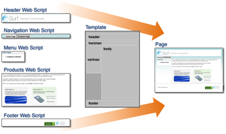
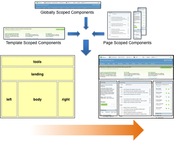

# Components

Surf lets you bind components to the regions. A component usually associates a region with a web script. Templates and scoped regions make it possible to reuse web scripts. You can have as many web scripts as you like, each encapsulating a unique bit of application functionality.

For example:

A template brings several web scripts together into an overall markup structure. Here, you are rendering a page; however, the same concepts apply for any kind of view rendered from Surf using a template. Surf lets you define regions in various scopes and then resolves these upon request. This makes your site definition efficient and easier to manage by promoting reuse. Alfresco Share is an example of a Surf application whose pages are constructed through reuse of templates. All three scopes are used. The following figure provides an example of how this fits together.

You can make changes to Alfresco Share pages by tweaking FreeMarker templates and web scripts. In Surf, web scripts not only provision remote interfaces to your applications, but also provide your application’s presentation logic. These are presentation tier web scripts. Surf orchestrates them so they can all live together on a single view and interoperate against a common request context.

There are many more capabilities, such as pre-processing controllers to generate markup that should be injected into different parts of a page \(for example, the `<head>` of an HTML page\). Surf also provides additional web script and template API root-scoped objects and methods.

**Parent topic:**[Surf View Composition framework](../concepts/surf-view-fwork-intro.md)

