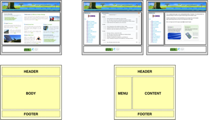
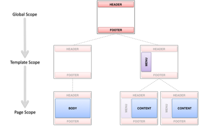
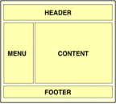

# Templates and regions

Once Surf looks at a URI and determines the request, it goes about the process of handling the view. The request may be for a specific page, a content item of type “article”, or a specific region of the current page \(for example, in an AJAX request\). Regardless of the request, the objective will eventually produce markup and send it out to the response. The key to making this happen is the template, which provides the basic layout of the response to the browser.

A template is a reusable layout that you can build once and then apply it to many pages. Each page can then benefit from a common look-and-feel that was pre-prescribed. By changing the template, a web designer can affect many pages all at the same time. This is especially meaningful for large websites where you may need to manage hundreds, if not thousands, of pages.

The following figure shows three pages for a sample website. Two of the pages are similar with the same page layout. They have four regions on the page, whereas the first page has only three regions. As such, you can describe these three pages with two templates. The templates are shown below the pages.



The first template defines three regions with placeholder names \(HEADER, BODY, FOOTER\). The second template defines four regions \(HEADER, MENU, CONTENT, FOOTER\). The HEADER and FOOTER regions are common across all three pages. You can define the two templates in Surf and define regions along with region scope to allow reuse across templates, as illustrated in the following figure.




In this figure, the region scope defines the entire website with only two templates and five scoped regions. There are three scopes: global, template, and page. Regions in the global scope need to be configured only once. Then, their configuration is reused by any templates or pages that include them. In this case, the HEADER and FOOTER regions are defined once in the global scope. Their content appears the same on all of the pages of the site.

Regions in the template scope need to be configured once per template. Any pages that use the template then reuse their configuration. In this case, the MENU region is defined in the template scope for one of the templates, but not the other. Thus, the two pages on the right side that use this template will have the MENU region in common. Regions in the page scope must be configured once per page, and their configurations are not reused. In this case, the BODY and CONTENT regions are in the page scope. This allows the two right-hand pages to be slightly different, but only in the CONTENT region.

The region tag defines regions on a template with the scope, such as page, template, or global. The following examples show how this is done in FreeMarker:

```
Globally scoped header region:
<@region id=”header” scope=”global” />

Template scoped navigation region:
<@region id=”navigation” scope=”template” />

Page scoped content region:
<@region id=”content” scope=”page” />
```

A template defines the basic structure of the rendered view, and then defines regions into which to include additional presentation. The following figure shows an example of the template that defines four regions: HEADER, MENU, CONTENT, and FOOTER. Sample code below the figure suggests how you could weave this into a FreeMarker template. It is up to Surf to resolve what to place in each of these regions when the template is rendered.



```
<html>
   <head>
      ${head}
   </head>
   <body>
      <div class=”header”>
         <@region id=”header” scope=”global” />
      </div>
      <div class=”menu”>
         <@region id=”menu” scope=”template” />
      </div>
      <div class=”content”>
         <@region id=”content” scope=”page” />
      </div>
      <div class=”footer”>
         <@region id=”footer” scope=”global” />
      </div>
   </body>
</html>
```

When the template is processed, each of its region tags executes and attempts to look up something that should be included in that location in the template. The region tag is replaced by the output of something that is bound into that place in the template.

**Parent topic:**[Surf View Composition framework](../concepts/surf-view-fwork-intro.md)

