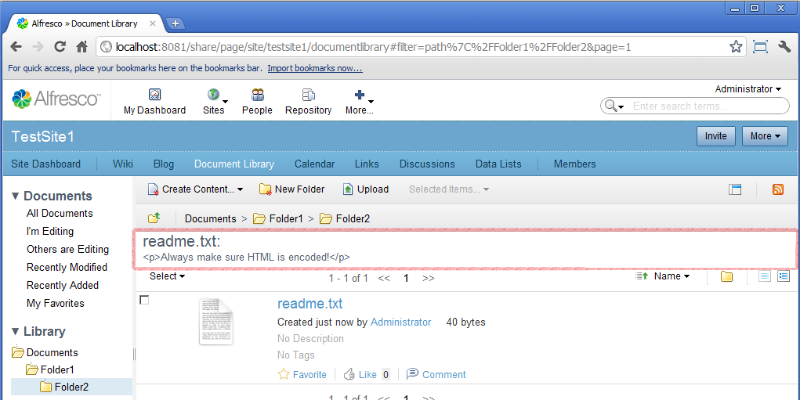
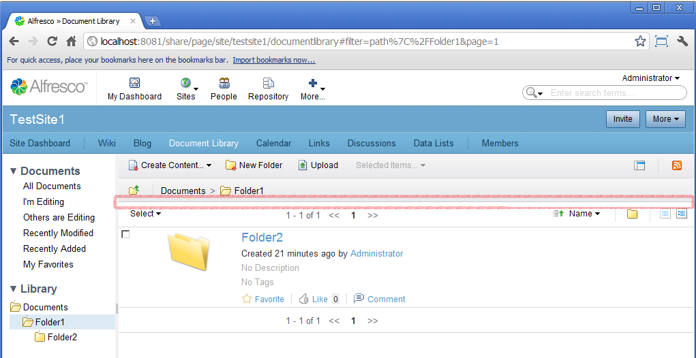

# 7. Auto-Readme extensions example

This tutorial discusses how to extend the Document Library for a site to automatically display the content of any readme.txt files in the current folder. It is not intended to explain the extensibility features but simply to show how they can be applied to achieve a practical result.

The extension that you are going to create will automatically display the contents of the first file called readme.txt found in the currently selected folder in a *site* Document Library.

To understand the widgets used to implement the Document Library you require a good understanding of JavaScript and the Yahoo User Interface \(YUI\) library.

The Document Library that you will find on a regular site is made up of the following Components: filter, tree, tags, toolbar and document list. If you want to change the behaviour of these widgets then you will need to take the following approach:

1.  Create a new JavaScript object that extends the JavaScript widget and store it in a JavaScript file with a .js file extension.
2.  Override the web script that backs the Component and ensure that the \*.head.ftl loads your library and that the .html.ftl instantiates your widget.

Using SurfBug you can identify that the Document List is rendered by the Component `template.documentlist.documentlibrary` and its Sub-Component `default` \(which was generated from legacy configuration\).

You can insert some new content by defining a new Sub-Component in an extension module. The Sub-Component needs to be backed by a Web Script which will render some new HTML to display the contents of a readme.txt file if one exists. If you have used the Document Library you will have noticed that changing the path does not reload the entire page and inspection of the code reveals that AJAX requests to refresh the Document List are made on receipt of a `filterChanged` event. This means that you will need to create a JavaScript widget to listen for those events and respond accordingly.

The full list of files needed are as follows:

-   doclib-extension.xml - A configuration file defining a module that adds a new Sub-Component.
-   auto-readme.get.desc.xml - A descriptor file for a new web script that will display readme.txt content.
-   auto-readme.js - A new JavaScript file defining the widget that will listen for the `filterChanged` event.
-   auto-readme.css - A new CSS file with the styling for the Sub-Component.
-   auto-readme.get.head.ftl - A  web script .head.ftl file that will ensure that the JavaScript and CSS imports gets added to the HTML <head\> element.
-   auto-readme.get.html.ftl - A web script .html.ftl file that will define the HTML for displaying the readme.txt content and instantiate the JavaScript widget.

The files will need to go in the following locations in a JAR file:

-   alfresco/site-data/extensions/doclib-extension.xml
-   webscripts/auto-readme.get.desc.xml
-   webscripts/auto-readme.get.head.ftl
-   webscripts/auto-readme.get.html.ftl
-   META-INF/doclib/extensions/auto-readme.css
-   META-INF/doclib/extensions/auto-readme.js

**Note:** The JavaScript and CSS files can be located anywhere below the META-INF directory. Any resources that are not loaded by the Spring Surf configuration or web script classloader code need to be placed in the META-INF path in order to be loaded.

Create the JAR, copy it to webapps\\share\\WEB-INF\\lib, restart Alfresco Share and deploy the module. You will see something similar to the following where the site Document Library contains a suitable readme.txt file:

 

**Parent topic:**[Tutorials](../concepts/surf_share_v4-tutorials.md)

