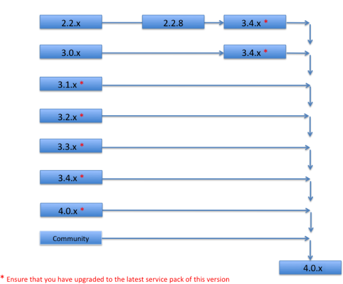

# Alfresco upgrade paths

When you upgrade Alfresco, it is recommended that you follow a structured upgrade path between versions.

Alfresco supports upgrading up to two major versions above your existing version. In the table, 3.x and 2.2 are all considered to be major version.

**Major version upgrades**

Direct upgrades to 4.0 are supported from only 3.1.x and later. Upgrades of 2.1, 2.2 and 3.0 require an interim step involving an upgrade to the latest version, for example 3.3.5 or 3.4.11, before upgrading to version 4.0.

To upgrade to the latest version, first apply the latest service pack for your current version, then upgrade to the latest version \(including service pack\). For versions before 3.1, firstly you must upgrade to the latest 3.4 Service Pack \(currently 3.4.7\), and then upgrade to 4.0 . For version 3.1 and later, the first step is to upgrade to the latest Service pack , and then upgrade to 4.0. 

The following diagram shows the upgrade paths for major versions. However, if a direct upgrade to version 4.0 is not successful, an interim step to version 3.3.5 or 3.4.x may be necessary.

For example, if your production environment currently runs Alfresco 2.2.2, you need to upgrade to version 2.2.8, and then version 3.4.11 before you can upgrade to version 4.0.2.

**Note:** If you are upgrading from an earlier release that is not shown on this diagram, contact Support for assistance.

**Parent topic:**[Upgrading](../concepts/ch-upgrade.md)

