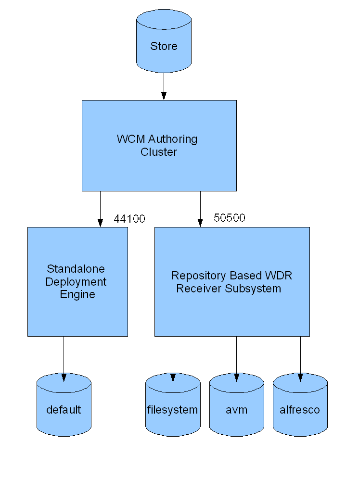

# Deploying from AVM

Deployment provides a framework for pushing content from an AVM authoring environment into another environment. For example you can push out content to a flat file system, to be served up by Apache or IIS, or to another instance of Alfresco.

The AVM authoring environment provides the facilities to produce an approved and consistent view of a web project called a snapshot. Deployment takes those snapshots and pushes them out to either live or test servers. The Deployment Engine receives deployments from an AVM authoring environment and delegates the contents of the deployment to the appropriate deployment receiver target. The deployment process may be automated so that it happens automatically when content is approved for publishing.

There are two implementations of the Deployment Engine:

-   Standalone deployment engine, which is a small lightweight framework that is independent of the Alfresco repository
-   Deployment engine, which is a subsystem within the Alfresco repository

Deployments are sent to the Deployment Engine, which delegates the deployment to the registered deployment targets. Deployment targets are registered using the Web Project wizard.

