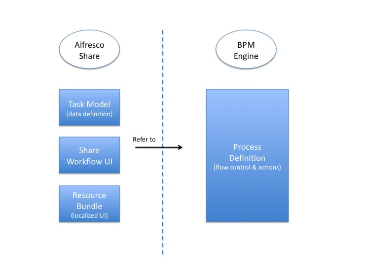

# Workflow artifacts

In Alfresco, a workflow consists a number of artifacts.

The diagram below shows the artifacts and the relationship between them:-

-   **Process Definition**

    Activiti process definitions describe the events, activities \(tasks\) and gateways \(choices\) of a workflow. Tasks may be user tasks or script \(system\) tasks. User tasks are assigned to human performers \(users\). System tasks perform some kind of operation against the Alfresco repository. Both are described and implemented in the Process Definition.

-   **Task Model**

    The Task Model provides a description for each of the user tasks in the workflow. Each task description consists of:

    -   Name and Title.
    -   Properties and Associations. For example, the information attached to the task.
    The description is used to drive the user interface dialog for viewing and managing the Task. Alfresco provides a Data Dictionary for describing types of object to store, view and edit. This mechanism is also used to describe Workflow Tasks.

-   **Share Workflow UI**

    You can customize the presentation of Tasks to the user in Alfresco Share. Customizing allows:

    -   Control over which Task properties are displayed
    -   Control over which Task properties are read-only and required
    -   Control over how each Task property is rendered in the forms
-   **Resource Bundle \(optional\)**

    A workflow resource bundle provides all the human-readable messages displayed in the user interface for managing the workflow. Messages include Task titles, task property names, task choices etc. Alfresco supports full localization of Alfresco Share, including workflow. Therefore, the same Alfresco Share resource bundle configuration extends to workflow too.

**Parent topic:**[Workflow Architecture](../concepts/wf-architecture.md)

