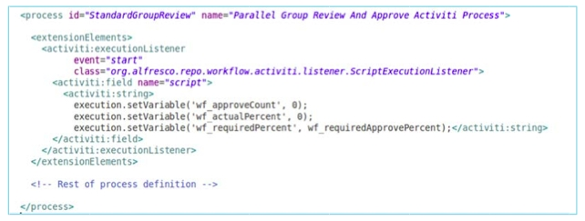

# Execution listeners

Execution listeners are invoked at point in the process outside of user tasks.

There are three events available:

-   **start**

    invoked at the beginning of process execution, before the start event.

-   **end**

    invoked at the end of the process execution, after the end event.

-   **take**

    invoked when a sequence flow is invoked.

The code below shows an example of an execution listener to be invoked at the beginning of the process execution.

Listeners are described in detail in the Activiti user guide.

**Parent topic:**[Listeners](../concepts/wf-process-def-listeners.md)

**Related information**  

[Activiti user guide](http://www.activiti.org/userguide/)

