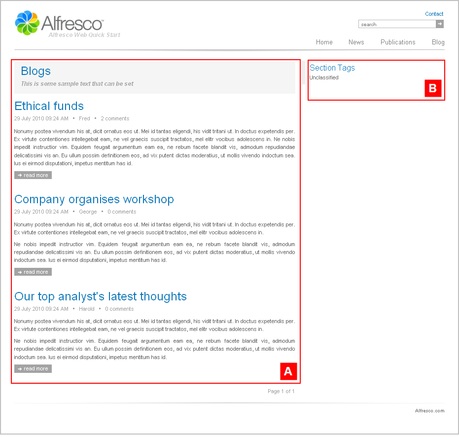

# sectionpage2

The section **Alfresco Quick Start \> Quick Start Editorial \> root \> blog** has the template mapping `ws:indexPage=sectionpage2`.

This is a section landing page template that features a single column article list and a list of section tags. This template page has a two column layout.

View the Blog landing page on the Web Quick Start website to see a rendering of the `sectionpage2` template.

|A|Component: `/list/detailed`This component displays a paginated list with comment count.

The content is populated from:

**Quick Start Editorial \> root \> blog \> collections \> latest.articles**This is a dynamic asset collection.

|
|B|Component: `/tags/list`This component displays a vertical list of tags suitable for the right region.

|

**Parent topic:**[Templates](../references/qs-ref-templates.md)

