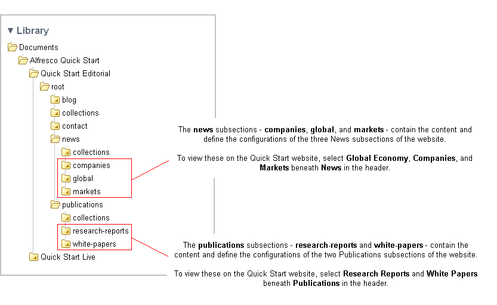

# Subsections

Both the **news** and **publications** sections contain subsections, which appear as sub-menu items in the website header.

The following image displays the subsections in the Finance example of the Web Quick Start site in Share.

**Parent topic:**[Breaking down the Web Quick Start site structure](../references/qs-ref-anatomy.md)

