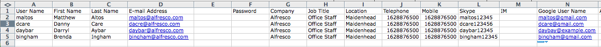
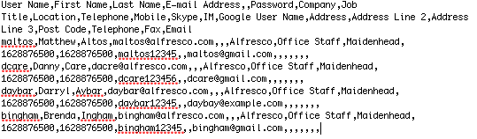

# Uploading multiple users

The Admin Console lets you easily upload externally created users from within a comma-separated \(CSV\) file.

When initially setting up the accounts for your users, it can be time consuming to create multiple users individually. Alfresco lets you create these users by uploading a file that contains the list of all your users. The file needs to contain the names and other details, separated but commas.

You can create this file, either from a text file or from a Microsoft Office spreadsheet. You need to create the file using named headings and the following order:

```
User Name,First Name,Last Name,E-mail Address,,Password,Company,Job Title,Location,Telephone,Mobile,
Skype,IM,Google User Name,Address,Address Line 2,Address Line 3,Post Code,Telephone,Fax,Email
```

You don't need values for all the headings for each users. For example, the following sample shows the content of a CSV file using Microsoft Excel:



Save the file as a .csv file, which you can then upload into Alfresco.



1.  Open the Admin Console, and then click **Users**.

    You'll see the User Search page.

2.  Click **Upload User CVS File**.

3.  Locate and upload the CSV file:

    1.  Click the Select file\(s\) to upload icon.

    2.  Browse for the CSV file containing the users.

        The CSV file has an extension of .csv.

    3.  Select the file, and then click **Open**.

    4.  Click **Upload File\(s\)**.

    The users from the CSV file are uploaded into Alfresco and you see the **Upload Results** page showing the list of user names and status. An email will be sent to the user informing them of their new Alfresco user account.


**Parent topic:**[Managing users](../concepts/at-adminconsole-users.md)

