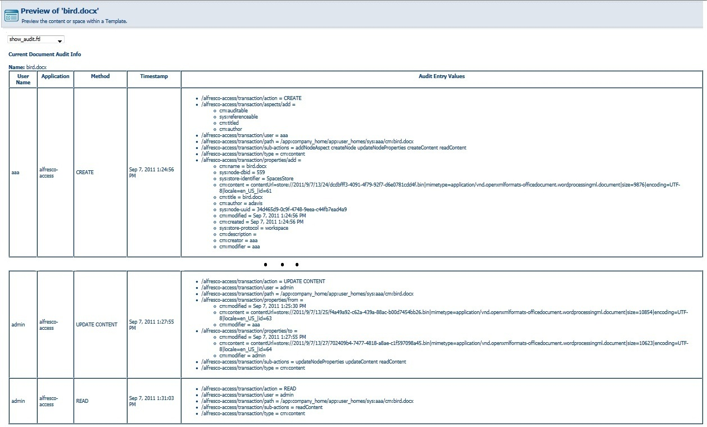

# Using Alfresco Explorer to view the example audit trail

The audit trail of individual content may be viewed from within Alfresco Explorer.

1.  Locate the content.

2.  Select **Preview in Template**, using the show\_audit.ftl preview.

    The following is an example of some high level events.

    

**Parent topic:**[Content auditing technical overview](../concepts/audit-content-techdesc.md)

