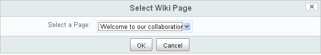
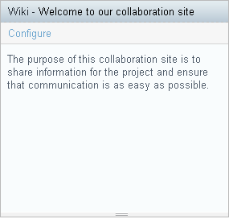

# Add the introduction to the site dashboard

Once you create a wiki page, you can set it to be the main wiki page. The content for this page appears in the Wiki dashlet on the site dashboard.

1.  Within your site, click **Site Dashboard** on the banner.

    This returns you to the site dashboard for the current site.

2.  Click **Configure** on the Wiki dashlet.

    The Select Wiki Page page displays.

    

3.  Click **OK** to accept the page you have just created.

    The Wiki dashlet displays the text from the selected wiki page.

    

**Parent topic:**[Create an introduction](../tasks/gs-intro-create.md)

