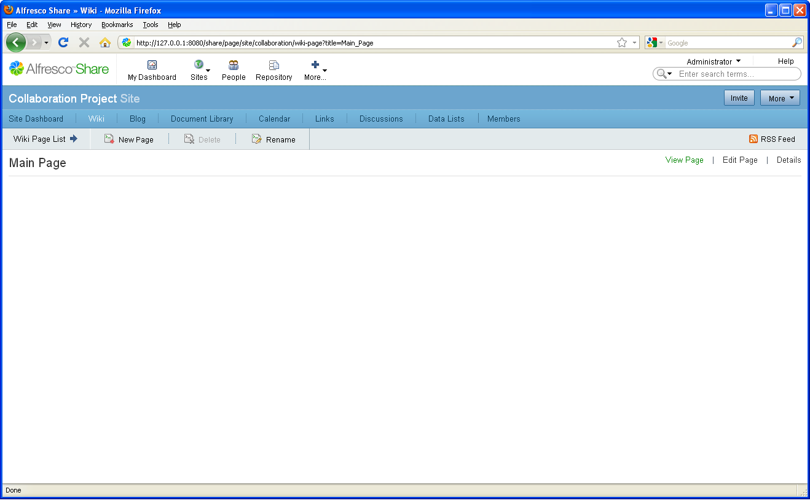

# Create an introduction

You use the Wiki page component within your site to write your introduction. Once it is written, you add it to the Wiki dashlet on your site dashboard.

1.  Within your site, click **Wiki** on the banner to open the Wiki page component.

    The Wiki page component opens.

    

2.  Click **New Page** and type Welcome to our collaboration site as the title.

3.  Add the following content: The purpose of this collaboration site is to share information for the project and ensure that communication is as easy as possible.

4.  Add the tag collaboration.

5.  Click **Save**.

The new page displays.

-   **[Add the introduction to the site dashboard](../tasks/gs-intro-add.md)**  
Once you create a wiki page, you can set it to be the main wiki page. The content for this page appears in the Wiki dashlet on the site dashboard.

**Parent topic:**[Prepare your site for collaboration](../concepts/gs-site-prepare.md)

