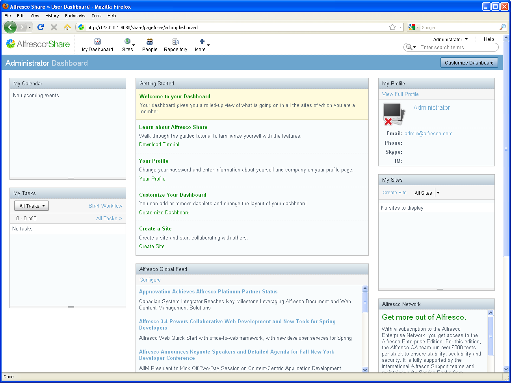

# Log in

Log in to Alfresco Share using the default credentials.

1.  Type the following on the login page:

    1.  **Username**: admin

    2.  **Password**: admin

2.  Click **Login**.

    On entering the application, your personal dashboard displays.

    

    You track all information relevant to you on your personal dashboard.

-   **[About dashlets](../concepts/gs-dashlet-intro.md)**  
 My Dashboard is where you track all information relevant to you.
-   **[Set up your personal dashboard](../tasks/gs-dashboard-setup.md)**  
You can set up your personal dashboard to tailor the view you have, depending on your requirements.
-   **[Publish your credentials](../tasks/gs-publish-credentials.md)**  
As part of the site, you want to publish your credentials for all site members to view.

**Parent topic:**[Getting Started with Alfresco Share Collaboration](../concepts/gs-intro.md)

