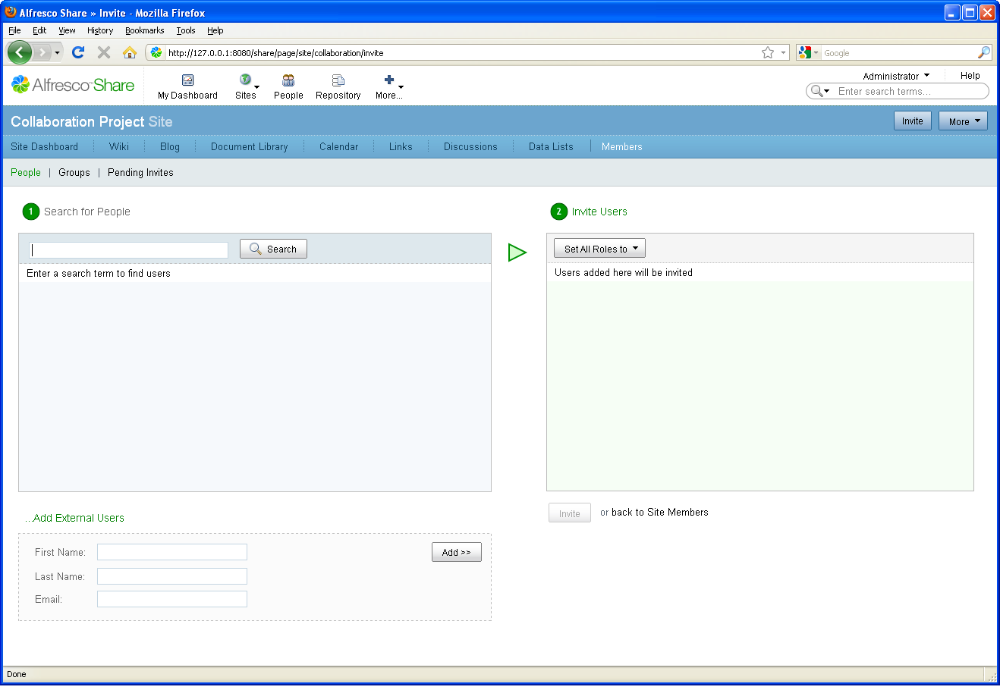
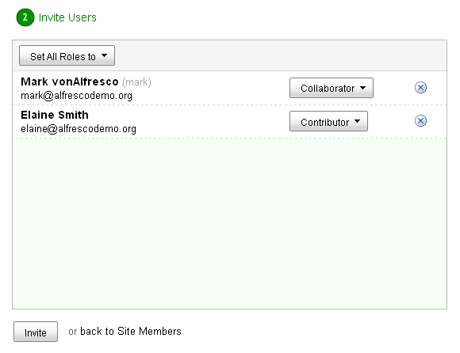

# Invite members to your site

After you have set up your collaborative site, you can invite people to join it.

1.  Within your site, click **Invite** on the banner.

    The Invite page displays.

    

2.  In the **Search for People** section, type the full or partial name of an internal user you want to invite and click **Search**.

    **Important:** If you do not have any users for this installation, add them using the Share Admin Console \(on the toolbar, expand the **More** menu and click **Users**\). Otherwise, skip to step 4.

3.  Click **Add** associated with the user you want to add.

    The user displays in the **Invite Users** list.

4.  In the **Add External Users** section, type the first name, last name, and email for the external user you want to invite, then click Add.

5.  In the Invite Users list, select a role from the Select Role menu for each user.

    **Note:** If you want to assign all users the same role, select a role from the Set All Roles to menu to apply to all of the users listed. The role displays in the menu.

    

6.  Click Invite.

You are notified that the invite has been sent via email to each member invited.

**Parent topic:**[Getting Started with Alfresco Share Collaboration](../concepts/gs-intro.md)

