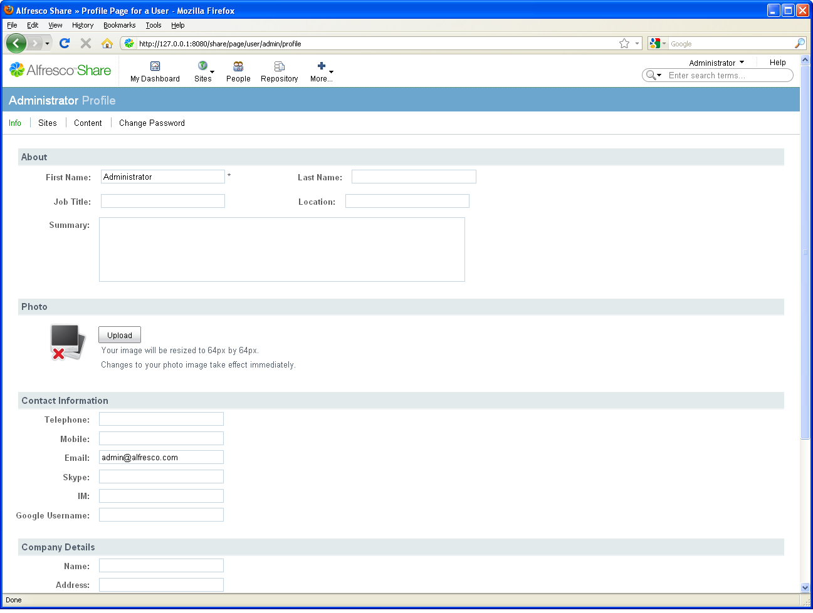

# Publish your credentials

As part of the site, you want to publish your credentials for all site members to view.

You publish your credentials via your My Profile page component. It enables you to:

-   Edit your profile
-   Change your password

On the application toolbar, the name of the currently logged in user appears as a menu above the search field. As you are logged in as the default administrative user, the menu displays the name **Administrator**. This menu provides convenient access to your user profile and other commonly used features.

**To publish your credentials:**

1.  Expand the user menu on the toolbar and click **My Profile**.

    Your profile displays.

2.  Click **Edit Profile** and complete the information as desired.

    

3.  Click **Save Changes**.

Your profile displays with the updated information.

**Parent topic:**[Log in](../tasks/gs-login.md)

