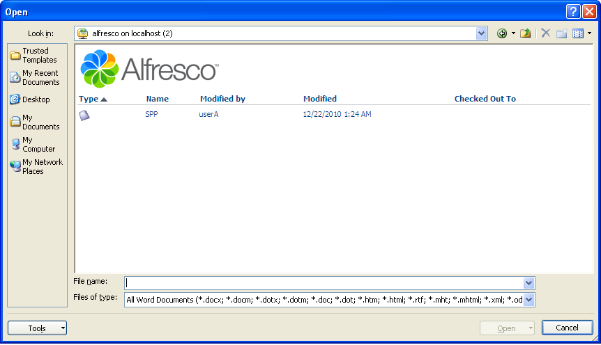
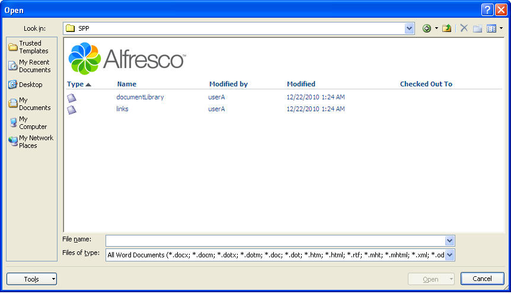
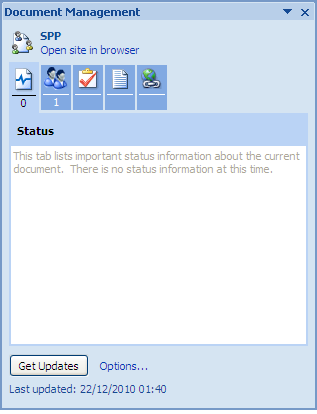

# Edit a Document Workspace document

You can open a document stored in a Document Workspace from Word itself. Once open, you display the Document Management task pane, which contains many of the document management features available.

Editing a document includes the following tasks:

-   Opening a Document Workspace document
-   Checking out the document
-   Updating the document
-   Checking in the document

First, open the document you just created and added to the SPP Document Workspace.

To open the Document Workspace document:

1.  In Word, click the Microsoft Office button and select **Open**.

2.  Enter http://<Alfresco server URL:7070\>/alfresco as the **File name** and click **Open**.

    **Note:** If prompted, log in as User A \(userA, userA\)

    This returns a list of all existing Share sites. The window switches to the Web View.

    

3.  Select **SPP** and click **Open** to navigate into that site.

    

4.  Select the **documentLibrary** folder and click **Open**.

5.  Select **local.docx** and click **Open**.

    Word displays the selected document, which you will use in the next two tasks to walk through the process of editing a file.

6.  Click the Microsoft Office button and select **Server**, then **Document Management Information**.

    The Document Management task pane displays.

    

    The name of the Document Workspace, or Share site, appears at the top of the pane.

    There are five tabbed panels available on this pane: Status, Members, Tasks, Documents, and Links. Position your cursor over a tab to display the tab name.

-   **[Check out the document](../tasks/gs-spp-doc-checkout.md)**  
Checking out a document to edit it locks the file to all other users while you make your changes. Members of the Document Workspace can still view and download the original version of the document while you have it checked out.
-   **[Check in the document](../tasks/gs-spp-doc-checkin.md)**  
When you finish editing a checked out document, you must check it in to update the original in the Document Workspace. This removes the lock so the updated version is available for other users.

**Parent topic:**[Manage a document](../concepts/gs-spp-doc-manage.md)

