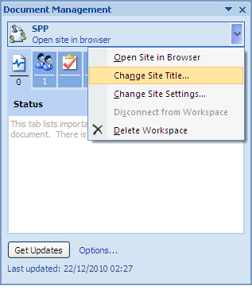

# Edit the site name

Ensure the document spp-tutorial.docx is open on your computer. The Document Management task pane is open in the document window with the site name, SPP, displayed at the top. This is the name you will edit.

To edit the site’s display name:

1.  On the Document Management task pane of the document spp-tutorial.docx, position your cursor over the site name: **SPP**.

2.  Open the menu that becomes active and select **Change Site Title**.

    

3.  Change the site title to SharePoint Protocol Support and click **OK**.

4.  \(Optional\) To verify the edit:

    1.  On the Document Management task pane, click **Open site in browser** beneath the Document Workspace name \(SharePoint Protocol Support\).

    2.  Log in as User A \(userA, userA\).

        The site dashboard appears, now named SharePoint Protocol Support Site.

    3.  Log out of Share and close the browser.

**Parent topic:**[Customize the Document Workspace](../concepts/gs-spp-workspace-customize.md)

